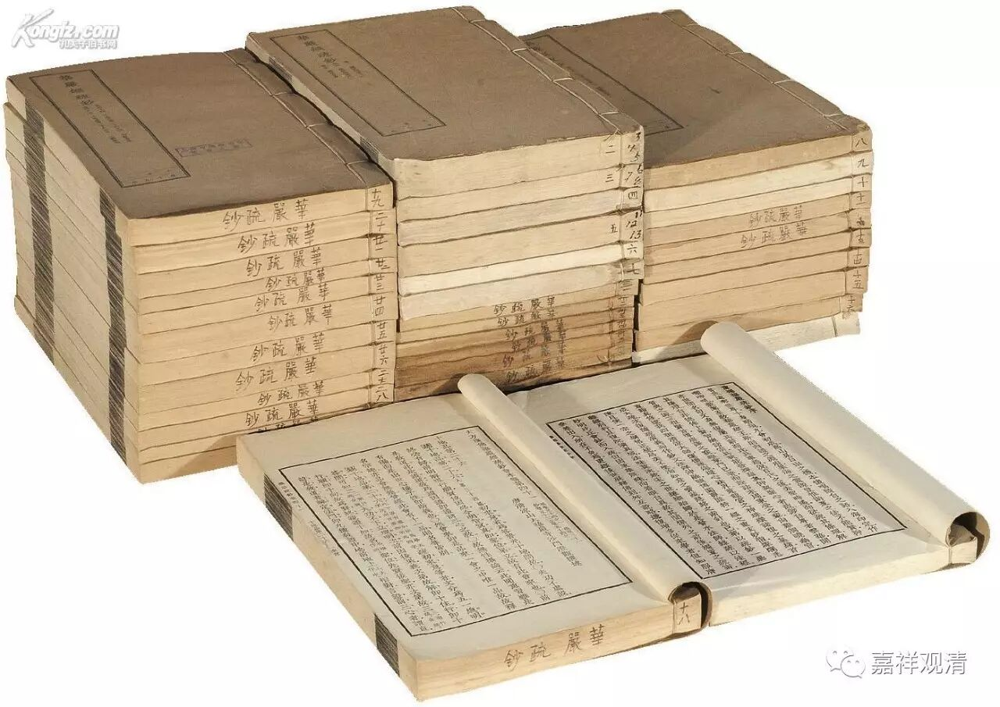

**《金刚经》055（下）**

下面就来了第二十四个问题：“若云如来色身非断灭，则菩萨云何修得福德身？”如果说佛身不是断灭的，那么菩萨怎么修得这个福德身呢？

** “须菩提，若菩萨以满恒河沙等世界七宝，持用布施。若复有人，知一切法无我，得成于忍，此菩萨胜前菩萨所得功德。何以故？须菩提，以诸菩萨不受福德故。”**

** **

好，我们一句句解释。** “须菩提，若菩萨以满恒河沙等世界七宝，持用布施。”**如果有人呢，** “以满恒河沙等世界七宝，持用布施。**”这个在前面已经讲过，福德是很大的，是吧？** “若复有人，知一切法无我，得成于忍，”**如果有人能够通达空性，而且** “得成于忍”**——这个可以理解为安住，在这个上面安住。忍可以是安忍的意思。这里的忍，就是安住在这上面不动，就是得到了这个定境，或者说圣界。** “此菩萨胜前菩萨所得功德。”**这样的菩萨的功德，要超过之前那个菩萨的功德。为什么呢？他不是在数量上取胜的。** “何以故？须菩提，以诸菩萨不受福德故。”**这个“诸”不是指全部的菩萨，是指这样的菩萨。当然，要说是全部的菩萨也可以噢。那么，这样的菩萨** “不受福德”**。这个** “不受福德”**，马上就被有些人从字面理解为没有福德了。

** “须菩提白佛言：‘世尊，云何菩萨不受福德？’”**须菩提这是在和佛演戏，他是捧哏的。为什么说菩萨不受福德呢？

** “须菩提，菩萨所作福德，不应贪著，是故说不受福德。”**这个不受，其实是不贪着的意思。就是说，菩萨要怎样获得三十二相、八十种好的如来福德身呢？是要以和空相应的智慧行布施。单单有和空相应的智慧也不行，要以和空相应的智慧来行布施。再加上之前所讲的结合起来，前面还需要发菩提心，在菩提心的引导下，以和空相应的智慧行福德之事，也就是布施、持戒、忍辱、精进、禅定这些方便，这个就是福德身的因缘。

这里面还要讲一下，** “不受福德”**，就是对这些福德不贪取，不是为了求福德的目的，而是以“为利众生愿成佛”的目的去行福德的因缘，同时以和空相应的智慧来摄持，这样的菩萨可以修得佛的福德身。

第二十三个问题是问佛有没有福德身，有没有色身？那么佛有三十二相、八十种好，这个是佛的福德身，并不是说这个福德身不是佛身，而真正的佛身是自性身。乃至《华严经》也说：

** 法性本空寂，无取亦无见；**

** 性空即是佛，不可得思量。**

接下来，这个福德身怎么获得呢？菩萨要在发起菩提心以后，修和空相应的智慧，以和空相应的智慧来摄持福德资粮，这样成佛以后就会获得福德身。成佛的时候是三身或者四身同时成就的，不可能有一个佛是只有自性身而没有报化身的，或者只有化身而没有报身和智慧身，这是不可能的。这都是因缘嘛，因上修的是福德资粮和智慧资粮，果上得的就是福德身和智慧身，是吧？澄观法师在《华严疏抄》里也谈到佛身空性的能依、所依。法性的佛身不离福德身而存在，此福德身，是法性身的所依。

好，今天已经讲完第二十四个问题了，先到这里，谢谢大家！

