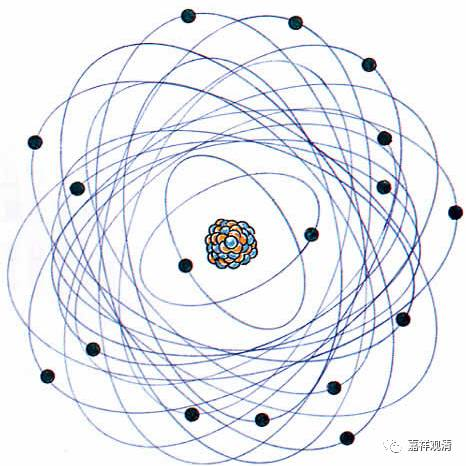

**《金刚经》 056（一）**

好，我们继续《金刚经》。

现在应该讲第二十五个问题了。前面第二十二个问题是关于三十二相的：佛身能不能用观三十二相、八十种好来观察？回答是不能。接下去的问题就变成：既然说如来不应以三十二相来观的话，那么佛就没有福德身了吗？显然是有的。那菩萨是怎么修得福德身的呢？菩萨是在发菩提心以后，以与智慧相应的福德来修得福德身。

接下来的第二十五个问题，其实是延续第二十二个问题而来的。第二十二个问题中说法身才是真正的佛身嘛，不应以三十二相观如来。于是，第二十五个问题就要问：“色身、法身，为一？为异？”色身和法身，到底是为一还是为异？

** “须菩提，若有人言‘如来若来、若去、若坐、若卧’，是人不解我所说义。何以故？如来者，无所从来，亦无所去，故名如来。”**

** **

我们对这段话应该已经非常熟悉了，听得太多了。但还是要再提醒大家，这个不是定义哦！须菩提，如果有人说“如来这样来来去去，或者行住坐卧”等等，那他就没有理解上面所说的，为什么呢？** “如来者，无所从来，亦无所去，故名如来。”**这里还是在讲如来的法身，真正的佛身是如来的法身。比如说藏传佛教的格鲁派对于佛的定义是一个无为法，是吧？二障断除。这个定义的意思是要说，佛是一个无为法，不是一个有为法，否则就出问题了。如果你归依的佛，他是一个有为法的，呵呵，那就是无常了。

** “须菩提，若善男子善女人，以三千大千世界碎为微尘，于意云何，是微尘众，宁为多不？”**这个微尘是什么意思呢？这个微尘就是极微，就是今天我们经常听到的部派佛教里面专门谈的极微，在百法里面叫“极略色”——最小最小的物质单位，就是这里的“微尘”，就是指极微。早期的时候鸠摩罗什法师是翻译成微尘的，后期玄奘法师就翻译成极微。

须菩提，发起菩提心的善男子善女人，把三千大千世界整个地碎为微尘，就是把三千大千世界拆成一个一个的极微。** “于意云何”**，我来问一问，** “是微尘众，宁为多不？”**就是把三千大千世界全部拆成最小的单位，那么这样的微尘多不多呢？前面讲** “恒河沙等”**，是吧？这个应该比恒河沙还要多了吧？这样的微尘，多不多呢？

** “须菩提言：‘甚多，世尊。’”**这样的微尘肯定多啊！** “何以故？若是微尘众实有者，”**如果这些微尘是实有的话，** “佛则不说是微尘众。”**佛就不说这些是微尘众，或者就不说三千大千世界的微尘多。** “所以者何？佛说微尘众，即非微尘众，是名微尘众。”**佛说的这个微尘，不是实有的微尘，这个微尘就是极微。

