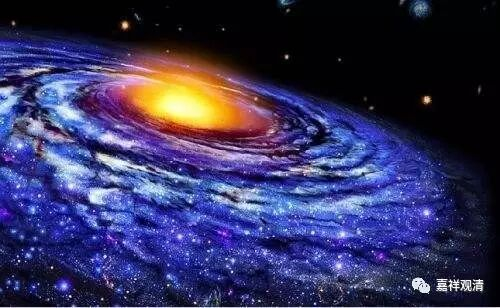

**《金刚经》056（四）**

** “须菩提，一合相者，则是不可说，但凡夫之人贪著其事。”**所谓的“一合相”——只是一个整体而没有部分的这种东西——是根本不存在的。但是我们总认为，感觉上这个事情就是这样的，感觉某某事物就是某某事物，好像它不是由它的支分所组成的。比如说一支球队，我们好像一谈起来就把它当作一个整体一样，而且是“不是支分”的整体。如果我们去分析的话，好像是有支分哦。但是从我们感觉上来说，就觉得没有。

我过两天会讲其他课，也会提到这个问题。在我们的概念当中，经常会出现莫名其妙的这种“一合相”的东西，这是什么呢？我们好像认为在各个支分组成一个整体以后，就有一个独立的整体的东西出现了。我再讲得慢一点。举个例子吧，A、B、C、D放在一起以后，突然有一个独立于A、B、C、D的E就出现了。这个大家可以回去想一想，自己有没有这样的情况。在很多理论上都会有这个情况的。我们仔细分析一下的话，我们还真的是这样认为的，好像觉得有一个东西变出来了，而且是一个既实有又独立于它的支分的东西而存在。大乘佛教说：这样的东西是没有的！但是呢，** “凡夫之人贪著其事。”**我们总认为是这样的。包括佛教的某些部派，还有一些外道的部派，都认为是这样的，就会凭空地出现一些东西。

假如我们把这些东西用中观的观点来解释，就很容易理解了，是什么呢？我们先不说地水火风或者A、B、C、D是不是实有的，这个往后再分析。如果是A、B、C、D放在一起，然后出现了一个我们认为的比如说念珠或者杯子等等的东西。杯子呢，其实它不是一个实有的东西，它是一个类似概念性的东西，但是我们习惯于什么呢？我们在心理的认知上会以“假必依实”的习惯认为，在杯子这个名言的背后，（或者说，在它的支分以外，有新的作用，之前那些支分所不具备的作用出现，）杯子这个东西就存在了，但实际上背后的这种存在是没有的……因为大家不是现场听，我这么讲，又不能够比划，不知道大家能不能听懂。

这里面世界和“一合相”的意思，能够明白了吗？世界呢，是作为一个整体，微尘呢，是作为一个部分。微尘也好，世界也好，都不是实有的。离开了微尘，也没有世界，离开了世界，也没有微尘，对吧？同理，佛的法身和色身呢？成佛的时候，法身和色身同时存在。没有一个只有色身而没有法身的佛，也没有一个只有法身而没有色身的佛。

好，今天《金刚经》先讲到这里，谢谢大家！

