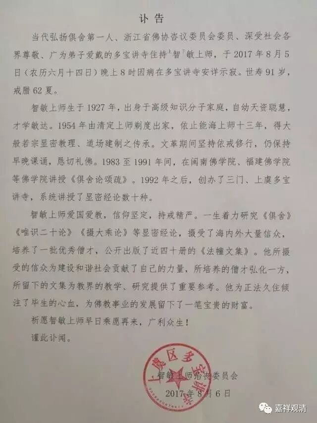

**
**

** 讣 告**

** 当代弘扬俱舍第一人、浙江省佛协咨议委员会委员、深受社会各界尊敬、广为弟子爱戴的多宝讲寺住持上智下敏上师，于2017年8月5日（农历六月十四日）晚上8时因病在多宝讲寺安详示寂。世寿91岁，戒腊62夏。**

** 智敏上师生于1927年，出身于高级知识分子家庭，自幼天资聪慧，才学敏达。1954年由清定上师剃度出家，依止能海上师十三年，得大般若宗显密教理、道场建制之传承。文革期间坚持依戒修行，仍保持早晚课诵，恳切礼佛。1983至1991年间，在闽南佛学院、福建佛学院等佛学院讲授《俱舍论颂疏》。1992年之后，创办了三门、上虞多宝讲寺，系统讲授了显密经论数十种。**

** 智敏上师爱国爱教，信仰坚定，持戒精严。一生着力研究《俱舍》《唯识二十论》《摄大乘论》等显密经论，摄受了海内外大量信众，培养了一批优秀僧才，公开出版了近四十册的《法幢文集》。他所摄受的信众为建设和谐社会贡献了自己的力量，所培养的僧才弘化一方，所留下的文集为教界的教学、研究提供了重要参考。他为正法久住倾注了毕生的心血，为佛教事业的发展留下了一笔宝贵的财富。**

** 祈愿智敏上师早日乘愿再来，广利众生！**

** 谨此讣闻。**

** **

** 智敏上师治丧委员会**

** 2017年8月6日**

** 上虞区多宝讲寺**

**
**

** 大师法眼久已闭，堪为证者多散灭，**

** 不见真理无制人，由鄙寻思乱圣教。**

** 自觉已归胜寂静，持彼教者多随灭，**

** 世无依怙丧众德，无钩制惑随意转。**

** 既知如来正法寿，渐次沦亡如至喉，**

** 是诸烦恼力增时，应求解脱勿放逸！**