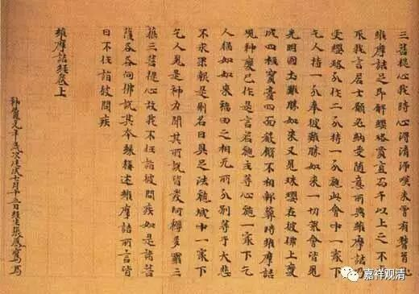

**“佛身无为，不堕诸数”（二）**

《注维摩诘经》是罗什、僧肇、道生等南北朝时期高僧注解《维摩诘经》的合集本，保留了早期什公门下诸师之意趣。《经注》在“佛身无为，不堕诸数”下，有肇师解云：

“肇曰：法身无为而无不为。无不为故现身有病，无为故不堕有数。”

肇师借用道家的“无为而无不为”来解释佛身无为而现起利他作用。其释“不堕诸数”为“不堕有数”，或者可以理解为“不属于有为法”、“不属于三界”。

《注维摩诘经》此处还有“生公说法”：

“生曰：虽曰无漏或有为也。有为是起灭法，虽非四大犹为患也。佛既以无漏为体，又非有为，何病之有哉？为则有数也。”

道生法师说：佛也有有为无漏法，但有为法皆生灭无常；佛之有为法虽非有漏，但仍旧有局限（譬如得病）。其真佛身乃无漏无为，因此并无局限和过患。“有为”就“有数”。这里，生公也把数解释为有为法。

其后，嘉祥吉藏《维摩经义疏》承上二师所说，释云：“既是无为，不随有数”。清凉澄观《华严经疏》则云“非一非异，不堕数故”，以“非一非异”解“不堕数”，亦大致相通。

《维摩诘经》，奘师译为《说无垢称经》。对应罗什译本，相应章节，唐译为：

“阿难陀！如来身者即是法身，非杂秽身；是出世身，世法不染；是无漏身，离一切漏；是无为身，离诸有为；出过众数，诸数永寂。”

什译“佛身无为”，奘译“是无为身，离诸有为”；什译“不堕诸数”，奘译“出过众数，诸数永寂”。

基大师《说无垢称经疏》释“出过众数，诸数永寂”曰：

“……五、出众数。不堕生数，数永寂故。但堕法数，众生必是趣界生获。体即第八异熟无记识。佛身唯无漏、唯善故，非生数所摄。如是之身，当有何疾？阿难少见，谓……堕在欲界人趣之身……”

基师释“不堕诸数”为“不堕众生数”，谓佛身不是六道五趣之身所摄——则又别开一种解释。若再上溯回去，肇公、生公、嘉祥大师之“有数”，似也可以理解为“三有之数”……

