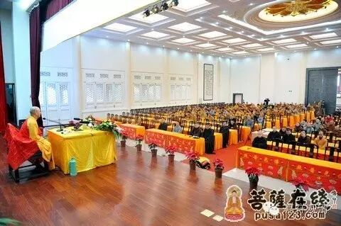

**《金刚经》 057（上）**

好，《金刚经》还有最后两个问题了，就快讲完了。

前面第二十五个问题讲了佛的法身，那么，基于这个法身的背景，第二十六个问题就出现了：“如是，则彼法身当即是‘我’？！”下面的听众会这么认为：前面讲不能以三十二相来观如来，那么这个法身应该就是佛的“我”了。法身就是“我”——大家会这么理解。因为大家通常都是认为，既然那个不是了，那么这个就是了嘛，这个就应该是“我”了。在凡夫的时候也有这个空性，成佛的时候也有这个空性，显然这个就是“我”了，这就是轮回的主体了——这就是世间人的理解。

释迦佛和须菩提就继续来谈这个问题了。释迦佛来提问：** “须菩提，若人言：”**如果有人说：** “‘佛说我见、人见、众生见、寿者见。’须菩提，于意云何，是人解我说义不？”**如果有人说：佛说有我，佛有我执。** “我见、人见、众生见、寿者见”**是一个意思，我们已经提过多次。如果有人说佛是这么说的，“佛说有我、佛有自性执”，来，须菩提，你认为怎么样？这个人了解我的意思吗？

** “不也，世尊。”**不是这样的，世尊。** “是人不解如来所说义。”**这个人他没有理解如来所说的话。** “何以故？”**为什么呢？** “世尊说我见、人见、众生见、寿者见，即非我见、人见、众生见、寿者见，是名我见、人见、众生见、寿者见。”**这个** “我见、人见、众生见、寿者见”**，也就是我执。我执有没有呢？我执是有的。至少对我们来说，我们有没有我执呢？有的，我们的我执是有的。我们千万别以为我们是没有我执的，我们明显是有我执的。那么，对于我执来说，如果说它是一个心的话，它也是无自性的，也是唯名言有。因为它也是心，是心的话它就有心王，有心所伴随等等，还要有心的对象——境，所以我执也是唯名言有而自性空的，也是依赖于其他条件而建立的。

