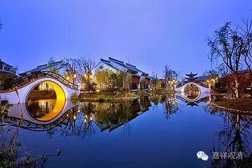

**《金刚经》 058（上）**

好，今天应该讲二十七问题中的最后一个，是结束的部分了。

前面第二十六个问题是：“如是，则彼法身当即是‘我’？！”因为前面讲了应观导师的法性即导师的法身，那么就会有人认为：如来的法身是“我”。而这里的回答是：如来的法身是他的无自性，最后所指向的是无我，而不是指向我们所认为的“我”。

佛的法性，就是空性——一般我们会这么说哦，“在凡不减，在圣不增”，它是一个无为法。如果是这样的话，那么佛是常住世间的喽，也没有涅槃不涅槃的说法了吧？这个是我们一般人会有的问题。所以，这第二十七个问题就是：“佛当常住世间，不当涅槃？！”

** “须菩提，若有人以满无量阿僧祇世界七宝，持用布施，若有善男子善女人，发菩提心者，持于此经，乃至四句偈等，受持读诵，为人演说，其福胜彼。**

** 云何为人演说？不取于相，如如不动。何以故？**

** 一切有为法，如梦幻泡影，**

** 如露亦如电，应作如是观。”**

** **

也有人把这四句当作《金刚经》中提到的四句偈。我们前面已经谈到了，其实不一定是指具体的哪四句，随便哪一段都可以。在义净法师的版本当中，这四句是这样翻译：** “一切有为法，如星翳灯幻，露泡梦电云，应作如是观。”**义净法师对于《金刚经》最末一颂专门写过一篇文章进行解释的，大家可以去看一下，或者明天我发一下。

好，我们来解释一下。** “须菩提，若有人以满无量阿僧祇世界七宝，”**阿僧祇，也是无量的意思，就是用那么多的七宝拿来布施。但是如果有发菩提心的人，** “持于此经，乃至四句偈等，”**以般若经乃至最下的其中一段文字，** “受持读诵，为人演说，”**书写、受持等等，或者以今天的话来讲，印刷、讲经、礼拜、供养等等，** “其福胜彼。”**这个功德要超过之前那个人布施的功德。

我们也讲过要有与空相应的智慧，是吧？这里就直接点出了：** “云何为人演说？”**要怎么去宣讲呢？其实不仅仅是怎么去宣讲，受持、读诵也是一样的，要怎么样做才会有这样大的功德呢？** “不取于相，如如不动。”“不取于相”**，就是前面所说的** “不生法相”**或者** “不生法想”**——在一切法上不取法想，以与空相应的智慧，以证空的或者至少是通达空性的智慧来摄持。** “如如不动”**，如，好像；如，真如；不动，究竟的诸法的自性，也就是空性，这个法是无为法。** “如如不动。何以故？”**为什么呢？前面讲这是一个无为法，为什么呢？因为一切有为法，都是动的，是吧？

** “一切有为法，如梦幻泡影，如露亦如电，应作如是观。”**我们应该这样去观察有为法：** “如梦幻泡影，如露亦如电。”**这里只讲了有为法，其实也就是从反面讲了无为法。无为法是什么呢？就是上面的** “如如不动”**。有为法，就是无常的、造作的。

