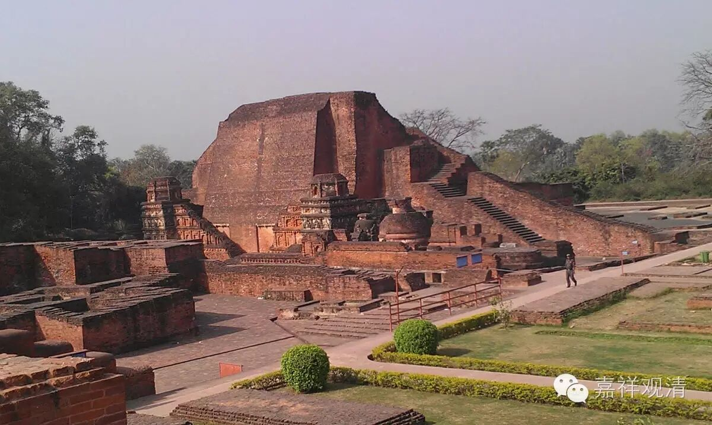

**《金刚经》058（下）完结篇**

第八个呢，是如电。电比喻什么呢？电比喻现在。现在，刹那一闪就过去了。空中的闪电，刹那刹那就过去了，所以就用电来比喻现在。

第九个是云。用云来比喻什么呢？用云来比喻未来。未来也是像云一样，看起来很美好，是吧？但是它真的有吗？反正还没到呢。它的自体，可能有部会说它是有的，但我们认为未来也不是实有的。这个云呢，也是要依赖于各种条件而存在，又是非常虚幻的，所以用云来比喻。

我们再来看鸠摩罗什法师的版本：** “一切有为法，如梦幻泡影，如露亦如电，应作如是观。”**在义净法师的版本中，多了一个星、一个翳、一个灯和一个幻，还多了一个云，但是少了一个影。大家有兴趣的话，可以去再看一下义净法师的版本。我们上次也说了，如果有机会的话，我们再印刷出一版鸠摩罗什法师和义净法师两个翻译版本的对照。

这整个一段在讲什么呢？就是我们前面讲的第二十七个问题：“佛当常住世间，不当涅槃？！”佛如果是无为法的话，那么也就没有什么涅槃不涅槃了。大乘佛法里面，包括《现观庄严论》里也讲了** “智不住生死，悲不住涅槃”**，是吧？我们在前面也讲过** “应观佛法性，即导师法身”**。佛自己也讲了，只要有正法的地方，就是佛所在的地方。所以，就像前面讲的，我们如果认为** “如来若来、若去、若坐、若卧，是人不解我所说义。”**这个好像已经讲了好多次了，真正佛的法性或者无为法，我们才在定义上称之为佛，是吧？

最后一段就是流通分：** “佛说是经已，长老须菩提及诸比丘、比丘尼、优婆塞、优婆夷**（这个就是四众）** ，一切世间天、人、阿修罗，闻佛所说，皆大欢喜，信受奉行。”**，这是最后流通分的部分。

好，今天讲到这里，《金刚经》算是讲完了。我们这个《金刚经》的讲课呢，是采用微课堂的形式，相对轻松一点，主要是给大家增加一点知识，应该说这个目的基本达到了。现在每天也有人在整理，以文字的方式推送出来，大家也可以看一看，复习一下。

好，谢谢大家！《金刚经》的讲课也是缘起，因缘而起，没有大家也讲不了这个课。

随喜大家！

