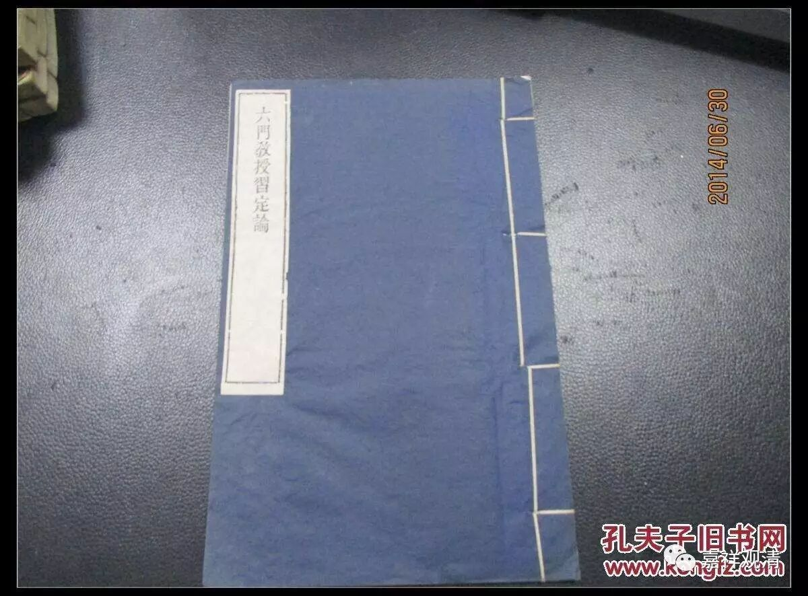

**《六门教授习定论》讲记001**

（皈依发心）

南无古汝贝，南无布达亚，南无达摩亚，南无桑嘎亚。（三遍）

诸佛正法贤圣三宝尊，从今直至菩提永皈依，

我以所修施等诸资粮，为利有情故愿大觉成。（三遍）

《般若波罗蜜多心经》

观自在菩萨，行深般若波罗蜜多时，照见五蕴皆空，度一切苦厄。

舍利子，色不异空，空不异色，色即是空，空即是色，受想行识亦复如是。

舍利子，是诸法空相，不生不灭，不垢不净，不增不减。是故空中无色，无受想行识，无眼耳鼻舌身意，无色声香味触法，无眼界乃至无意识界，无无明亦无无明尽，乃至无老死，亦无老死尽，无苦集灭道，无智亦无得，以无所得故。

菩提萨埵，依般若波罗蜜多故，心无挂碍；无挂碍故，无有恐怖，远离颠倒梦想，究竟涅槃。

三世诸佛，依般若波罗蜜多故，得阿耨多罗三藐三菩提。

故知般若波罗蜜多，是大神咒，是大明咒，是无上咒，是无等等咒，能除一切苦，真实不虚。

故说般若波罗蜜多咒，即说咒曰：揭谛，揭谛，波罗揭谛，波罗僧揭谛，菩提萨婆诃。

（回遮文）

南无顶礼上师，顶礼佛，顶礼法，顶礼僧，顶礼圣母般若波罗蜜多。以此顶礼诸尊力故，我等行者诸谛实语愿皆成就。犹如昔时，帝释天王忆念圣母般若波罗蜜多甚深之义，并诵其文，以此力故，魔王波旬等诸魔军、一切违缘，皆令遮止。如是，我亦忆念圣母般若波罗蜜多甚深之义，并诵其文，以此力故，魔王波旬等诸魔军、一切违缘，由圣三宝真实教令谛实力故，令皆回退（击掌），令皆无有（击掌），令皆寂灭（击掌）。一切冤魔、诸障碍等，最极寂灭，令具慈心。

八万四千魔类息，违缘损害魔障离，

顺缘圆满皆具足，以此吉祥愿安乐。

（供养）

遍地香涂鲜妙杂花敷，须弥四洲日月顶庄严，

以此所缘诸佛佛土献，愿诸众生清净佛刹行。

伊当 古如 日阿那 曼扎拉 冈尼日雅达雅弥。

今天开始我们讲** 《六门教授习定论》**。

这部论讲起来的时候我们作为汉人比较提气一点了，是吧？因为这部论只有汉地有，藏地是没有的，梵文本现在好像也没有。

** 《六门教授习定论》**是一部唯识宗的经典。我们发现，很多唯识的经典都有一个比较有趣的情况，就是不明确著作权到底归谁。有时候说是无著菩萨写的，也有说是世亲菩萨写的，还有说是这个罗汉或者那个罗汉写的，在汉传佛教和藏传佛教中的传说也不一样。比如《瑜伽师地论》，汉传佛教中就说是弥勒菩萨写的，而藏传佛教则说是无著菩萨写的。还有一些论典是有颂文、有解释的，有些地方就会说颂文和解释都是无著菩萨写的，但也有说颂文是无著菩萨写的，解释是世亲菩萨写的。

那么这部** 《六门教授习定论》**呢，在唯识系统里，算是著作权比较清晰的，可能因为只有汉地一种说法，在藏地暂时是没有这部论的译本的。它是一部专门讲修定方面的论典。** 《六门教授习定论》**的** 六门**，可以说是六品，或者六个方向，或者说六个科判、六个大科也可以。

关于** 教授**，吕澂先生讲过，一般来说，修定的教授比较多是是口耳相传，而无著菩萨感慨大家没有这样的教课书，就把这些教授写下来，所以说是非常难得的。如果把这部论给南传佛教看，可能他们会认为是泛泛而谈，还是没有特别细的内容，好像藏传类似口诀的内容不是很多。

** 习定**，说明它的内容是讲修定方面的。

** 《六门教授习定论》**肯定是属于大乘的论典。如果按照通常的分类习惯，要区分大小乘的话，它是属于大乘的论典，而且是属于经律论当中的论藏——我们暂时不用藏传对经律论的分法。藏传对于经律论的分法，实际上只是有部系统当中的一种说法，还不是有部主流的分法。但是，藏传就把这种分法当作主流了，就这样分了，那就这样分吧，这也是一种传承的说法，但我们这次还是不用藏传的“三藏说”。

