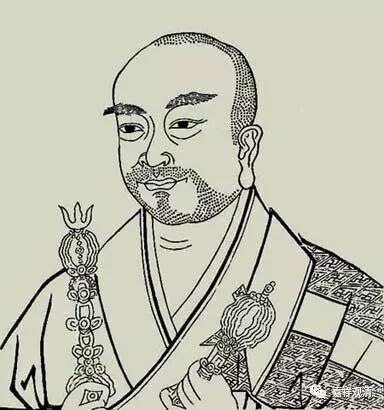

大唐三藏法师义净年谱

公元635年，唐贞观九年，义净生。

俗姓张，字文明，籍贯齐州，高祖曾为东齐郡守。

公元641年，贞观十五年，义净七岁。

于齐州城西四十里许之土窟寺出家，亲教师善遇，轨范师慧习。

公元645年，贞观十九年，义净十一岁。

玄奘法师游学归国。

公元646年，贞观二十年，义净十二岁。

义净之亲教师善遇去世。

公元651年，唐永徽二年，义净十七岁。

大约于此前后，义净萌发了去印度求法游学之心。

公元655年，唐永徽六年，义净二十一岁。

以慧习禅师为戒和尚，进受具足戒。

此后五年，“精求律典”，持戒甚严。乃效法头陀，乞食自活，日中一食，常坐不卧。

公元660年，唐显庆四年，义净二十六岁。

慧习禅师命义净出外游学。乃“杖锡东魏，颇沉心于《对法》、《摄论》；负笈西京，方阅想于《俱舍》、《唯识》”。

公元664年，唐麟德元年，义净三十岁。

此年二月五日，玄奘去世。

公元670年，唐咸亨元年，义净三十六岁。

于长安，结识处一、弘祎等僧人，相约西行求法。返齐州，请命于慧习禅师。得师赞许。

公元671年，唐咸亨二年，义净三十七岁。

年初，义净从齐州南下。

四至七月间，于扬州坐夏。

解夏后，随冯孝铨至广州，复至岗州，得其资助。时同志星散，唯有僧善行相随。

十一月，搭波斯船只，启程赴印度。至室利佛逝国。

公元672年，唐咸亨三年。义净三十八岁。

在室利佛逝国习学梵语，六个月。善行得病归国。

得彼国王支持，送往末罗瑜国。停两月，转赴羯荼。乘舟北行，途经裸人国。

公元673年，唐咸亨四年，义净三十九岁。

此年二月初八，义净到达印度。于耽摩立底国，结识玄奘弟子大乘灯。居停一年，习梵语。

公元674年，唐咸亨五年，义净四十岁。

于大乘灯结伴赴中印度，途中遇山贼洗劫。周游各处胜迹。

公元675年，唐上元元年，义净四十一岁。

至那烂陀寺学习。师从宝狮子等诸位大德。

公元685年，唐垂拱元年，义净五十一岁。

义净在那烂陀寺学修十年后，携经卷归国。

往耽摩立底，又遭劫匪。登船，往羯荼国。

公元686年，唐垂拱二年，义净五十二岁。

正、二月，至羯荼国。复“向师子洲”，停留至冬。南赴末罗游国。

公元687年，唐垂拱三年，义净五十三岁。

正、二月，至末罗游。

此间停留室利佛逝，抄经学法。师从佛逝国大德释迦鸡栗底。

公元689年，唐永昌元年，义净五十五岁。

七月二十日，至广州。十一月一日，约请僧人贞固、怀业、道宏、法朗搭商船南行。十二月，回到室利佛逝。

公元690年，唐载初元年。义净五十六岁。

九月，武则天改国号周，改元天授。

公元691年，天授二年，义净五十七岁。

义净在四位僧人协助下，译成一些经典，并作《南海寄归内法传》、《大唐西域求法高僧传》。

五月十五日，遣僧大津携《南海寄归内法传》、《大唐西域求法高僧传》及已译成的十卷经论，送往长安，并请“天恩于西方照寺”。

公元693年，长寿二年，义净五十九岁。

夏，义净与僧贞固、道宏归国，至广州。

公元694年，长寿三年，义净六十岁。

居广州。

公元695年，证圣元年，义净六十一岁。

五月仲夏，从广州至洛阳。携梵本近四百部，和五十万颂，金刚座真容一铺，舍利三百粒。武则天亲迎于上东门外。

敕住佛授记寺，旋移住大福先寺。敕令翻译携至之梵本。

公元699年，圣历二年，义净六十五岁。

数年间，参予实叉难陀之华严译场，义净与菩提流志共宣梵文。十月八日，《华严经》译成。

公元700年，圣历三年、久视元年，义净六十六岁。

住洛阳大福先寺。

五月五日，义净出《定不定印经》一卷。武则天制《大周新翻圣教序》。

十二月二十三日出《长爪梵志请问经》一卷，《根本萨婆多部律摄》二十卷。

公元701年，大足元年，义净六十七岁

住大福先寺。九月二十三日，出《弥勒下生成佛经》一卷、《善夜经》一卷、《大乘流转诸有经》一卷、《妙色王因缘经》一卷、《无常经》一卷、《八无暇有暇经》一卷、《佛顶尊胜陀庄严王陀罗尼咒经》一卷。

公元703年，长安三年，义净六十九岁。

住西明寺。十月四日，出《能断金刚般若波罗蜜多经》一卷、《掌中论》一卷、《取因假设论》一卷、《根本说一切有部毗奈耶》五十卷、《根本说一切有部尼陀那目得迦》十卷、《曼殊室利菩萨咒藏中一字咒王经》一卷、《六门教授习定论》一卷、《根本说一切有部百一羯磨》十卷、《金光明最胜王经》十卷、《龙树菩萨劝诫王颂》。

公元704年，长安四年，义净七十岁。

四月，作《少林寺戒坛铭并序》。

公元705年，唐神龙元年。中宗即位。义净七十一岁。

住洛阳大福先寺。七月十五日，于内道场，出《佛为胜光天子说王法经》一卷、《香王菩萨陀罗尼咒经》一卷、《一切功德庄严王经》一卷、《大孔雀咒王经》三卷。中宗为制《大唐龙兴三藏圣教序》。

公元706年，唐神龙二年。义净七十二岁。

义净随中宗回长安。

敕令于大荐福寺置翻经院，延义净译经。

公元707年，唐神龙三年，义净七十三岁。

延入内道场坐夏。出《药师琉璃光七佛本愿功德经》二卷，时“帝御法筵，手自笔受”。

公元710年，唐景龙四年，义净七十六岁。

於大荐福寺，四月十五日，出《佛为难陀说出家入胎经》二卷、《浴像功德经》一卷、

《数珠功德经》一卷、《观自在菩萨如意心陀罗尼咒经》一卷、《根本说一切有部苾刍尼毗奈耶》二十卷、《根本说一切有部毗奈耶杂事》四十卷、《疗痔病经》一卷、《根本说一切有部戒经》一卷、《根本说一切有部苾刍尼戒经》一卷、《五蕴皆空经》一卷、《三转法轮经》一卷、《譬喻经》一卷、《根本说一切有部毗奈耶颂》五卷、《根本说一切有部毗奈耶杂事摄颂》一卷、《根本说一切有部尼陀那目得迦摄颂》一卷、《罗尼经》一卷、《拔除罪障咒王经》一卷、《观所缘论释》一卷、《成唯识宝生论》五卷。

公元711年，唐景云二年，义净七十七岁。

闰六月二十三日，於大荐福寺，出《佛为海龙王说法印经》一卷、《能断金刚般若波罗蜜多经论颂》一卷、《能断金刚般若波罗蜜多经论释》三卷、《因明正理门论》一卷、《观总相论颂》一卷、《止观门论颂》一卷、《手杖论》一卷、《一百五十赞佛颂》一卷、《称赞如来功德神咒经》一卷、《略教诫经》一卷、《法华论》五卷、《集量论》四卷。

义净有《略明般若末后一颂赞述》，或成于此年。

公元712年，唐太极元年，义净七十八岁。

义净得病。二月十二日，门人崇勗为义净画像。睿宗作《像赞》。

七月二十五，睿宗传位玄宗。改元先天。

义净病势渐重。

据《贞元录》，义净又有译作《根本说一切有部毗奈耶药事》二十卷、《根本说一切有部毗奈耶破僧事》二十卷、《根本说一切有部毗奈耶出家事》五卷、《根本说一切有部毗奈耶安居事》一卷、《根本说一切有部毗奈耶随意事》一卷、《根本说一切有部毗奈耶皮革事》二卷、《根本说一切有部毗奈耶羯耻那事》，今皆存。

公元713年，唐先天二年，义净七十九岁。

义净疾笃。正月六日，睿宗遣使致问。

正月十七日初夜，义净留遗表。后半夜，义净卒于长安大荐福寺翻经院，年七十九，法腊五十九。

二月七日举行葬礼。“京城四众，陈布威仪卤薄，供养香花”，门人送葬达万余人。太上皇睿宗浅中使吊慰，赐物一百五十段，追赠鸿胪卿。

五月十五日，长安延兴门外灵塔建成。

公元758年，唐乾元元年。

于义净塔院，建成金光明寺。

