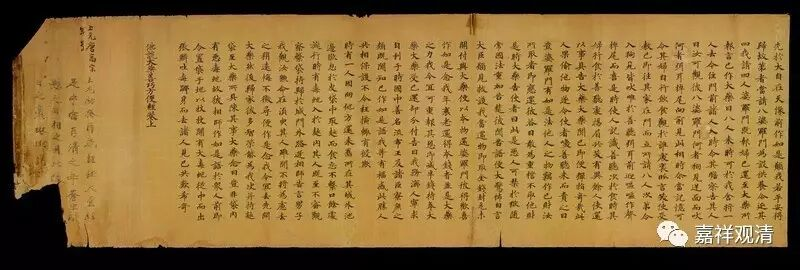

**《六门教授习定论》001（下）**

义净法师是我非常推崇的一位法师，这位法师非常了不起。中国人喜欢拿数字四来说事，有说中国佛教有“四大译经师”：鸠摩罗什、真谛、玄奘、义净。义净三藏位列其中。

四大译师还有一个流行的说法：鸠摩罗什、真谛、玄奘、不空。但我研究过不空三藏，此人的人品学问都实在无法和其余大译师相提并论，具体的，等我胆子大点了再写文章吧……所以，我们对“四大译师”的取舍，是弃不空而取义净的。

四大译师中，罗什法师属中观派，真谛、玄奘、义净这三位都是正宗唯识派。罗什法师的翻译，是古译和旧译的分界线；玄奘法师，则是旧译和新译的分界线。真谛三藏是安慧大师门人，其译本称为旧译唯识。义净三藏也翻译了不少唯识论典，但更大部头的是几乎完整地翻译了根本说一切有部律。四位译师当中，最幸运的是玄奘大师，全部译作保留下来了（73部，1335卷），其余三位都有译作散失；真谛三藏最不幸，时代最乱，散失的译本和著作最多；罗什大师的译本最受欢迎，文字最美；义净法师的声名最不显，主要是因为戒律和一般人关系不密切，而且根有律在汉地并没有弘扬起来……

三藏法师的三藏，是指经律论。既能讲经，又能讲律，又能讲论，或者说对经律论都能够很自在地开演的法师，我们就称为三藏法师。在唐代，对于能够开演经律论三藏的高僧都称为三藏法师。上述四大译经师，都称“三藏大师”、“三藏法师”。现在有法师专门写论文说“大唐三藏法师”是玄奘法师的专属名词，这样的讲法就稍微有点过了（大概是佛教史书读的太少的缘故吧），还有其他法师也被称为三藏法师的，比如义净三藏、不空三藏（正式里有这个称谓）等等。所以，三藏法师这个称谓并不只是专属于玄奘法师的。当然，民间的说法是另外一回事了，一讲“唐三藏”就是指玄奘了，甚至有些地方讲玄奘法师没人知道，讲“唐三藏”就大家都知道了。

呵呵，我们熟识的宝僧法师就是靠“唐三藏”、“唐僧”化缘了读书的钱。他去到某某基金会说：“我要去复旦读书。”人家就说：“你去复旦读书，管我什么事啊？”“研究佛教因明。”“因明是什么东西？”“我是要去研究玄奘法师的。”“玄奘？不认识。”“呃，就是研究唐僧——唐三藏。”“哦哦，可以，可以。这是佛教项目……”于是，基金会就拨给他一些读书的钱。哈哈……

不过，唐代以后就很少有人称三藏法师了，不多见了（有吗？）。什么原因呢？汉地不出三藏大师了吧——很多佛教史，写到中唐就收尾，“下边没有了”，乏善可陈也……

