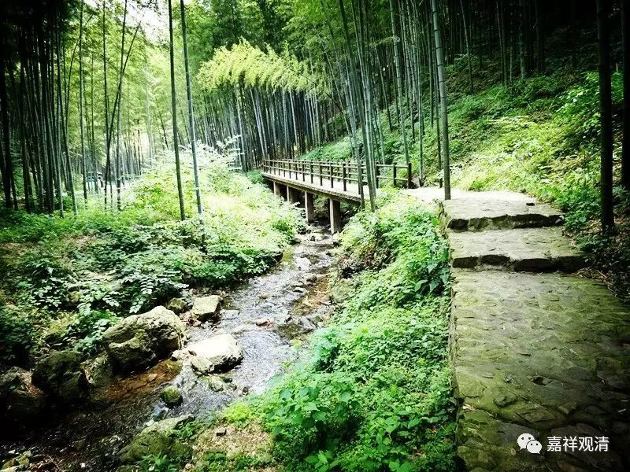

**每日一偈·七月**

若时间似水，今年已半空；

却不知此生，水流过半否？

年与日去，日以时弛；

诸般辛苦，换取乐无？

我爱我师者，因他得真理；

较我爱我师，我更爱真理。

有勤能补拙，勤能助智慧；

世出世间法，殷勤皆成办。

一剑断八不，五髻跨狞狮，

三世诸佛母，十方人天师。

有效的精进，

来自真正的喜欢。

流转无非苦，幻法终趋寂；

知幻断苦因，能离世间系。

往而不复，昔不至今；

吾犹昔人，非昔人也。

——毕业二十年……

心色非实有，亦非必竟无，

离言语分别，正观得其实。

智以应物，宽以待人；

说便容易，做到真难。

去圣时遥，法渐掺杂，

当细拣择，莫成外道。

业由自造，非因他成；

故自断惑，非责于他。

我学无上法，是为得解脱……

今涅槃虽远，出离乐少得，

家主辛苦事，略似已得脱。

工作和事业，怨厌与出离，

贪爱与慈心，差之岂毫厘？

愿诸践行者，于此能分别。

正念及正知，少欲与知足，

远离心寂静，为无上解脱。

我要这天，它再不遮我眼；

我要这地，再埋不了我心，

我要这众生，都明白我意，

我要那神魔，都烟消云散！

——《悟空传》

浮生若寄时空间，翠竹薄雾雨青天；

一切法依因待起，当知我命不由天。

诸法不牢固，常在于念中；

已解见空者，一切无想念。

——《童蒙止观》

若谁与我做损害，是成安忍所行境，

彼能成办安忍果，故遇逆境当感激。

内空外空，上空下空；

为有节碍，空不能通。

黑法当断，白法当学；

无漏之法，彼当速证。

诸法因缘有，无因缘不成；

心安立之理，亦当如是观。

诸法因缘生，如来说是因，

法灭亦如是，是大沙门说。

知家之过患，知家为牢狱，

知家体性空，出离于此家。

解结离恩爱，度老病死泥，

无执心自在，是真比丘哉！

若实善行者，常行不放逸，

念安般守意，能入止观门。

无惭无愧者，彼不得涅槃；

有惭及有愧，精进得安稳。

若人求寂灭，此寂灭非禅；

烦恼皆止息，证真最寂灭！

法身如虚空，无碍无形象；

色身如影显，种种众相现。

佛身不可取，无生无起作，

应物普现前，平等如虚空。

——《华严经》偈

如来出现于十方，

普应群心而说法；

世间所有种种乐，

圣寂灭乐为最胜！

——《华严经》

