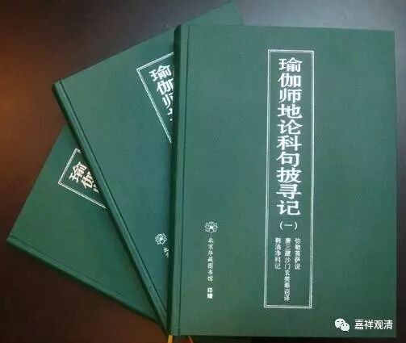

**《六门教授习定论》讲记002（上）**

** **

实际上，《六门教授习定论》的背景就是我们接下去很快会讲的《瑜伽师地论》中的《修所成地》，这二者几乎是可以全部对应起来的。而手上这部《六门教授习定论》的科判有所不同，但内容呢，只是开合的不同，或者说仅有详略的不同。都属于弥勒学，内容差别不大。

我们先来看这个表格。

《瑜伽·修所成地》与《六门教授习定论》科判对照表

四处

六门

七支

修处所

①意乐圆满（求脱者）

①生圆满

修因缘

②依处圆满（积集）

③本依圆满（于住勤修习）

④正依圆满（得三圆满已）

②闻正法圆满

③涅槃为上首

④能熟解脱慧之成熟

修瑜伽

⑤修习圆满（有依）

⑤修习对治

修果

⑥得果圆满（修定人）

⑥世间一切种清净

⑦出世间一切种清净

这里的第一列“四处”和第三列“七支”，都是出现《瑜伽师地论·修所成地》里面的。大家可以看《瑜伽师地论》卷第二十，《本地分中修所成地第十二》。

** “已说思所成地。云何修所成地？”《**思所成地》讲完了以后，《修所成地》是什么呢？** “谓略由四处，当知普摄修所成地。”《**修所成地》是按照四个方面来讲的，四个大的科判，也就是上面这个表格当中的第一列。** “一者，修处所；二者，修因缘；三者，修瑜伽；四者，修果。”**这个就是“四处”。

** “如是四处，七支所摄。”**这四处——修处所、修因缘、修瑜伽、修果，如果把它广开，就是“七支”。** “何等为七？”**哪七个呢？** “一、生圆满；二、闻正法圆满；三、涅槃为上首；四、能熟解脱慧之成熟；”**能成熟解脱慧的成熟，简单来说就是解脱慧之成熟。** “五、修习对治；六、世间一切种清净；”**就是世间清净。** “七、出世间一切种清净。”**就是出世间清净。

