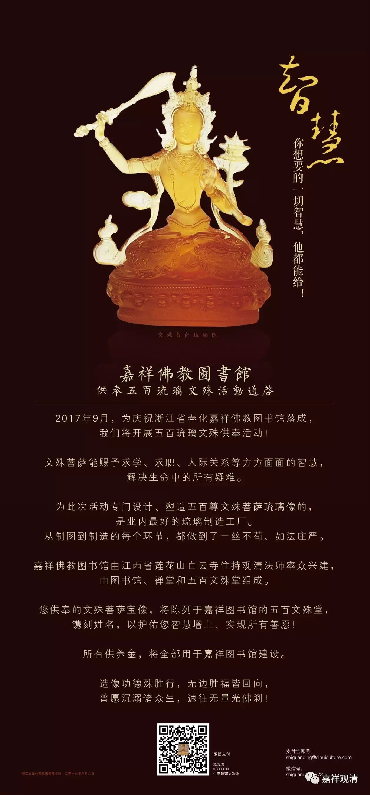

**文殊·智慧**

——嘉祥佛教图书馆供奉五百文殊活动通启

2017年9月，为庆祝浙江省奉化嘉祥佛教图书馆落成，我们将开展五百琉璃文殊供奉活动！

文殊菩萨能赐予求学、求职、人际关系等方方面面的智慧，解决生命中的所有疑难。

为此次活动专门设计、塑造五百尊文殊菩萨琉璃像的，是业内最好的琉璃制造工厂。从制图到制造的每个环节，都做到了一丝不苟、如法庄严。

嘉祥佛教图书馆由江西省莲花山白云寺住持观清法师率众兴建，由图书馆、禅堂和五百文殊堂组成。

您供奉的文殊菩萨宝像，将陈列于嘉祥图书馆的五百文殊堂，镌刻姓名，以护佑您智慧增上、实现所有善愿！

所有供养金，将全部用于嘉祥图书馆建设。

造像功德殊胜行，无边胜福皆回向，

普愿沉溺诸众生，速往无量光佛刹！

浙江省奉化嘉祥佛教图书馆

2017年8月8日

供奉者请微信联系观清法师，微信号shiguanqing1973

