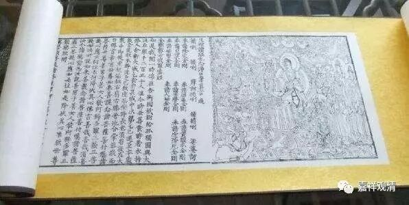

**佛说能断金刚般若波罗蜜多经**
　唐三藏沙门义净译

　　如是我闻。

一时薄伽梵，在名称大城战胜林施孤独园，与大苾刍众千二百五十人俱，及大菩萨众。尔时世尊于日初分时，着衣持钵，入城乞食。次第乞已，还至本处。饭食讫，收衣钵，洗足已，于先设座，加趺端坐，正念而住。

时诸苾刍来诣佛所，顶礼双足，右绕三匝，退坐一面。

尔时具寿妙生在大众中，承佛神力，即从座起，偏袒右肩，右膝着地，合掌恭敬白佛言：希有世尊！希有善逝！如来应正等觉，能以最胜利益，益诸菩萨，能以最胜付嘱，嘱诸菩萨。世尊，若有发趣菩萨乘者，云何应住，云何修行，云何摄伏其心？
　　佛告妙生：善哉善哉！如是如是！如汝所说，如来以胜利益益诸菩萨，以胜付嘱嘱诸菩萨。妙生，汝应谛听，极善作意，吾当为汝分别解说。若有发趣菩萨乘者，应如是住，如是修行，如是摄伏其心。

妙生言：唯然世尊，愿乐欲闻。

佛告妙生：若有发趣菩萨乘者，当生如是心。所有一切众生之类，若卵生、胎生、湿生、化生；若有色、无色；有想、无想、非有想非无想，尽诸世界所有众生，如是一切，我皆令入无余涅槃而灭度之。虽令如是无量众生证圆寂已，而无有一众生入圆寂者。何以故？妙生，若菩萨有众生想者，则不名菩萨。所以者何？由有我想、众生想、寿者想，更求趣想故。
　　复次，妙生，菩萨不住于事应行布施，不住随处应行布施，不住色、声、香、味、触、法应行布施。妙生，菩萨如是布施，乃至相应亦不应住。何以故？由不住施，福聚难量。
　　妙生，于汝意云何，东方虚空可知量不？

妙生言:不尔，世尊。

南、西、北方，四维、上下，十方虚空可知量不？

妙生言：不尔，世尊。

妙生，菩萨行不住施，所得福聚不可知量，亦复如是。
　　妙生，于汝意云何，可以具足胜相观如来不？

妙生言：不尔，世尊，不应以胜相观于如来。何以故？如来说胜相，即非胜相。

妙生，所有胜相，皆是虚妄，若无胜相，即非虚妄。是故应以胜相无相观于如来。

妙生言：世尊，颇有众生，于当来世，后五百岁，正法灭时，闻说是经，生实信不？
　　佛告妙生：莫作是说，颇有众生，于当来世后五百岁正法灭时，闻说是经生实信不。妙生，当来之世有诸菩萨，具戒、具德、具慧，而彼菩萨，非于一佛承事供养植诸善根，已于无量百千佛所而行奉事，植诸善根，是人乃能于此经典生一信心。
　　妙生，如来悉知是人，悉见是人，彼诸菩萨，当生当摄无量福聚。何以故？由彼菩萨无我想、众生想、寿者想、更求趣想；彼诸菩萨，非法想、非非法想、非想非无想。何以故？若彼菩萨有法想，即有我执、有情执、寿者执、更求趣执；若有非法想，彼亦有我执、有情执、寿者执、更求趣执。妙生，是故菩萨不应取法，不应取非法。以是义故，如来密意宣说筏喻法门。诸有智者，法尚应舍，何况非法！
　　妙生，于汝意云何，如来于无上菩提有所证不？复有少法是所说不？

妙生言：如我解佛所说义，如来于无上菩提，实无所证，亦无所说。何以故？佛所说法，不可取，不可说，彼非法，非非法。何以故？以诸圣者皆是无为所显现故。

妙生，于汝意云何，若善男子、善女人，以满三千大千世界七宝持用布施，得福多不？

妙生言：甚多，世尊。何以故？此福聚者，则非是聚，是故如来说为福聚福聚。
　　妙生，若有善男子、善女人，以满三千大千世界七宝持用布施，若复有人，能于此经，乃至一四句颂，若自受持，为他演说，以是因缘，所生福聚极多于彼无量无数。何以故？妙生，由诸如来无上等觉从此经出，诸佛世尊从此经生。是故，妙生，佛法者，如来说非佛法，是名佛法。
　　妙生，于汝意云何，诸预流者颇作是念：我得预流果不？

妙生言：不尔，世尊。何以故？诸预流者无法可预，故名预流。不预色、声、香、味、触、法，故名预流。世尊，若预流者作是念，我得预流果者，则有我执、有情、寿者、更求趣执。

妙生，于汝意云何，诸一来者颇作是念，我得一来果不？

妙生言：不尔，世尊。何以故？由彼无有少法证一来性，故名一来。

妙生，于汝意云何，诸不还者颇作是念，我得不还果不？

妙生言：不尔，世尊。何以故？由彼无有少法证不还性，故名不还。

妙生，于汝意云何，诸阿罗汉颇作是念，我得阿罗汉果不？

妙生言：不尔，世尊。由彼无有少法名阿罗汉。世尊，若阿罗汉作是念，我得阿罗汉果者，则有我执、有情、寿者、更求趣执。世尊，如来说我得无诤住中最为第一。世尊，我是阿罗汉，离于欲染，而实未曾作如是念，我是阿罗汉。世尊，若作是念，我得阿罗汉者，如来即不说我妙生得无诤住最为第一，以都无所住，是故说我得无诤住得无诤住。

妙生，于汝意云何，如来昔在燃灯佛所，颇有少法是可取不？

妙生言：不尔，世尊。如来于燃灯佛所，实无可取。

妙生，若有菩萨作如是语，我当成就庄严国土者，此为妄语。何以故？庄严佛土者，如来说非庄严，由此说为国土庄严。

是故，妙生，菩萨不住于事，不住随处，不住色、声、香、味、触、法，应生其心，应生不住事心，应生不住随处心，应生不住色、声、香、味、触、法心。

妙生，譬如有人，身如妙高山王，于意云何，是身为大不？

妙生言：甚大，世尊。何以故？彼之大身，如来说为非身，以彼非有，说名为身。
　　妙生，于汝意云何，如弶伽河中所有沙数，复有如是沙等弶伽河，此诸河沙，宁为多不？

妙生言：甚多，世尊。河尚无数，况复其沙。

妙生，我今实言告汝，若复有人，以宝满此河沙数量世界奉施如来，得福多不？

妙生言：甚多，世尊。

妙生，若复有人于此经中受持一颂，并为他说，而此福聚胜前福聚无量无边。妙生，若国土中有此法门，为他解说，乃至四向伽他，当知此地即是制底，一切天、人、阿苏罗等，皆应右绕而为敬礼，何况尽能受持读诵。当知是人，则为最上第一希有；又此方所即为有佛，及尊重弟子。
　　妙生，于汝意云何，颇有少法是如来所说不？

妙生言：不尔，世尊，无有少法是如来所说。

妙生，三千大千世界所有地尘，是为多不？

妙生言：甚多，世尊。何以故？诸地尘，佛说非尘，故名地尘。此诸世界，佛说非界，故名世界。

妙生，于汝意云何，可以三十二大丈夫相观如来不？

妙生言：不尔，世尊，不应以三十二相观于如来。何以故？三十二相，佛说非相，是故说为大丈夫相。

妙生。若有男子、女人，以弶伽河沙等身命布施，若复有人，于此经中受持一颂，并为他说，其福胜彼无量无数。

尔时妙生闻说是经，深解义趣，涕泪悲泣，而白佛言：希有世尊，我从生智以来，未曾得闻如是深经。世尊，当何名此经？我等云何奉持？

佛告妙生：是经名为《般若波罗蜜多》，如是应持。何以故？佛说般若波罗蜜多，则非般若波罗蜜多。

世尊，若复有人闻说是经生实想者，当知是人最上希有。世尊，此实想者即非实想，是故如来说名实想实想。

世尊，我闻是经，心生信解，未为希有，若当来世，有闻是经能受持者，是人则为第一希有。何以故？彼人无我想、众生想、寿者想、更求趣想。所以者何？世尊，我想、众生想、寿者想、更求趣想，即是非想。所以者何？诸佛世尊离诸想故。
　　妙生，如是如是。若复有人得闻是经，不惊、不怖、不畏，当知是人第一希有。何以故？妙生，此最胜波罗蜜多，是如来所说诸波罗蜜多。如来说者，即是无边佛所宣说，是故名为最胜波罗蜜多。

妙生，如来说忍辱波罗蜜多，即非忍辱波罗蜜多。何以故？如我昔为羯陵伽王割截支体时，无我想、众生想、寿者想、更来趣想，我无是想，亦非无想。所以者何？我有是想者，应生瞋恨。妙生，又念过去于五百世作忍辱仙人，我于尔时，无如是等想。是故应离诸想发趣无上菩提之心，不应住色、声、香、味、触、法，都无所住而生其心；不应住法，不应住非法，应生其心。何以故？若有所住，即为非住，是故佛说菩萨应无所住而行布施。
　　妙生，菩萨为利益一切众生，应如是布施，此众生想即为非想，彼诸众生即非众生。何以故？诸佛如来离诸想故。

妙生，如来是实语者、如语者、不诳语者、不异语者。
　　妙生，如来所证法及所说法，此即非实非妄。

妙生，若菩萨心住于事而行布施，如人入闇，则无所见。若不住事而行布施，如人有目，日光明照，见种种色。是故菩萨不住于事应行其施。

妙生，若有善男子、善女人，能于此经，受持读诵，为他演说，如是之人，佛以智眼悉知、悉见，当生当摄无量福聚。

妙生，若有善男子、善女人，初日分以弶伽河沙等身布施，中日分复以弶伽河沙等身布施，后日分亦以弶伽河沙等身布施，如是无量百千万亿劫以身布施，若复有人，闻此经典，不生毁谤，其福胜彼，何况书写、受持、读诵、为人解说。
　　妙生，是经有不可思议、不可称量、无边功德，如来为发大乘者说，为发最上乘者说。若有人能受持、读诵、广为他说，如来悉知、悉见是人，皆得成就不可量、不可称、不可思议福业之聚，当知是人则为以肩荷负如来无上菩提。何以故？妙生，若乐小法者，则着我见、众生见、寿者见、更求趣见，是人若能读诵、受持、此经，无有是处。

妙生，所在之处，若有此经，当知此处则是制底，一切世间天、人、阿苏罗，所应恭敬，作礼、围绕，以诸香花供养其处。
　　妙生，若有善男子、善女人，于此经典受持、读诵、演说之时，或为人轻辱。何以故？妙生，当知是人于前世中造诸恶业，应堕恶道，由于现在得遭轻辱，此为善事，能尽恶业，速至菩提故。

妙生，我忆过去，过无数劫，在燃灯佛先，得值八十四亿那庾多佛，悉皆供养、承事，无违背者；若复有人，于后五百岁正法灭时，能于此经，受持、读诵、解其义趣，广为他说，所得功德，以前功德比此功德，百分不及一，千万亿分、算分、势分、比数分、因分、乃至譬喻亦不能及。

妙生，我若具说受持、读诵此经功德，或有人闻，心则狂乱，疑惑不信。

妙生，当知是经不可思议，其受持者，应当希望不可思议所生福聚。
　　复次，妙生白佛言：世尊，若有发趣菩萨乘者，应云何住？云何修行？云何摄伏其心？

佛告妙生：若有发趣菩萨乘者，当生如是心，我当度脱一切众生悉皆令入无余涅槃，虽有如是无量众生证于圆寂，而无有一众生证圆寂者。何以故？妙生，若菩萨有众生想者，则不名菩萨。所以者何？妙生，实无有法可名发趣菩萨乘者。
　　妙生，于汝意云何，如来于燃灯佛所，颇有少法是所证不？

妙生言：如来于燃灯佛所，无法可证而得菩提。

佛言：如是，如是。妙生，实无有法，如来于燃灯佛所，有所证悟，得大菩提。若证法者，燃灯佛则不与我授记，摩纳婆，汝于来世，当得作佛，号释迦牟尼。以无所得故，燃灯佛与我授记，当得作佛，号释迦牟尼。

何以故？妙生，言如来者，即是实性真如之异名也。

妙生，若言如来证得无上正等觉者，是为妄语。何以故？实无有法如来证得无上正觉。妙生。如来所得正觉之法，此即非实非虚。是故佛说一切法者即是佛法。

妙生，一切法一切法者，如来说为非法，是故如来说一切法者即是佛法。

妙生，譬如丈夫，其身长大。

妙生言：世尊，如来说为大身者，即说为非身，是名大身。

佛告妙生：如是如是。若菩萨作是语；我当度众生令寂灭者；则不名菩萨。

妙生，颇有少法名菩萨不？

答言：不尔，世尊。

妙生，是故如来说一切法，无我、无众生、无寿者、无更求趣。

妙生，若有菩萨言，我当成就佛土严胜佛土严胜者，如来说为非是严胜，是故如来说为严胜。

妙生，若有信解一切法无性一切法无性者，如来说名真是菩萨菩萨。

妙生，于汝意云何，如来有肉眼不？

妙生言：如是，世尊，如来有肉眼。

如来有天眼不？

如是，世尊，如来有天眼。

如来有慧眼不？

如是，世尊，如来有慧眼。

如来有法眼不？

如是，世尊，如来有法眼。

如来有佛眼不？

如是，世尊，如来有佛眼。
　　妙生，于汝意云何，如弶伽河中所有沙数，复有如是沙等弶伽河，随诸河沙，有尔所世界，是为多不？

妙生言：甚多,世尊。

妙生,此世界中所有众生，种种性行，其心流转,我悉了知。何以故,妙生,心陀罗尼者,如来说为无持；由无持故，心遂流转。何以故？妙生,过去心不可得,未来心不可得,现在心不可得。

妙生,于汝意云何,若人以满三千大千世界七宝布施,是人得福多不？

妙生言：甚多，世尊。

妙生，若此福聚是福聚者，如来则不说为福聚福聚。
　　妙生，于汝意云何，可以色身圆满观如来不？

不尔，世尊，不应以色身圆满观于如来。何以故？色身圆满色身圆满者，如来说非圆满，是故名为色身圆满。

妙生，可以具相观如来不？

不尔，世尊，不应以具相观于如来。何以故？诸具相者如来说非具相，是故如来说名具相。
　　妙生，于汝意云何，如来作是念，我说法耶？汝勿作是见。若言如来有所说法者，则为谤我。何以故？言说法说法者，无法可说，是名说法。

妙生白佛言：世尊，于当来世，颇有众生，闻说是经生信心不？

佛告妙生：有生信者。彼非众生，非非众生。何以故？众生众生者，如来说非众生，是名众生。
　　妙生，于汝意云何，佛得无上正等觉时，颇有少法所证不？

妙生言：实无有法是佛所证。

佛告妙生：如是如是。此中无有少法可得，故名无上正等菩提。

妙生，是法平等，无有高下，故名无上正等菩提；以无我、无众生、无寿者、无更求趣性，其性平等故，名无上正等菩提；一切善法皆正觉了故，名无上正等正觉。

妙生，善法者，如来说为非法，故名善法。
　　妙生，若三千大千世界中所有诸妙高山王，如是等七宝聚，有人持用布施；若复有人，于此经中，乃至一四句颂，若自受持，及为他说，以前福聚比此福聚，假令分此以为百分，彼亦不能及一分，或千分、亿分、算分、势分、数分、因分、乃至譬喻亦不能及一。
　　妙生，于汝意云何，如来度众生不？汝莫作是见，如来度众生。何以故？曾无有一众生是如来度者。若有众生是如来度者，如来则有我见、众生见、寿者见、更求趣见。

妙生，我等执者，如来说为非执，而诸愚夫妄为此执。

妙生，愚夫众生，如来说为非生，故名愚夫众生。
　　妙生，于汝意云何，应以具相观如来不？

不尔，世尊，不应以具相观于如来。

妙生，若以具相观如来者，转轮圣王应是如来。是故不应以具相观于如来，应以诸相非相观于如来。

尔时世尊而说颂曰：
    若以色见我 以音声求我
    是人起邪觐 不能当见我
    应观佛法性 即导师法身
    法性非所识 故彼不能了
　　妙生，诸有发趣菩萨乘者，其所有法是断灭不？汝莫作是见。何以故？趣菩萨乘者，其法不失。

妙生，若有男子、女人，以满弶伽河沙世界七宝布施；若复有人，于无我理不生法中，得忍解者，所生福聚极多于彼无量无数。
　　妙生，菩萨不应取其福聚。

妙生言：菩萨岂不取福聚耶？

佛告妙生：是应正取，不应越取，是故说取。

妙生，如有说言，如来若来、若去、若坐、若卧者，是人不解我所说义。何以故？妙生，都无去来，故名如来。
　　妙生，若有男子、女人，以三千大千世界土地碎为墨尘，妙生，于汝意云何，是极微聚宁为多不？

妙生言：甚多，世尊。何以故？若聚性是实者，如来不说为极微聚极微聚。何以故？极微聚者，世尊说为非极微聚，故名极微聚。

世尊，如来所说三千大千世界，说为非世界故，名三千大千世界。何以故？若世界实有，如来则有聚执。佛说聚执者，说为非聚执，是故说为聚执。

妙生，此聚执者，是世言论，然其体性实无可说，但是愚夫异生之所妄执。

妙生，如有说云，佛说我见、众生见、寿者见、更求趣见者，是为正说？为不正耶？

妙生言：不尔，世尊。何以故？若有我见如来说者，即是非见故名我见。

妙生，诸有发趣菩萨乘者，于一切法，应如是知、如是见、如是解。如是解者，乃至法相亦无所住。何以故？妙生，法想法想者，如来说为非想，故名法想法想。
　　妙生，若有人以满无量、无数世界七宝持用布施，若复有人，能于此经，乃至受持、读诵四句伽他，令其通利，广为他人正说其义，以是因缘所生福聚，极多于彼无量无数。云何正说？无法可说，是名正说。

尔时世尊说伽他曰：
    一切有为法 如星翳灯幻
    露泡梦电云 应作如是观
   尔时薄伽梵说是经已，具寿妙生，及诸菩萨摩诃萨，苾刍、苾刍尼；邬波索迦；邬波斯迦；一切世间天、人、阿苏罗等，皆大欢喜，信受奉行。

