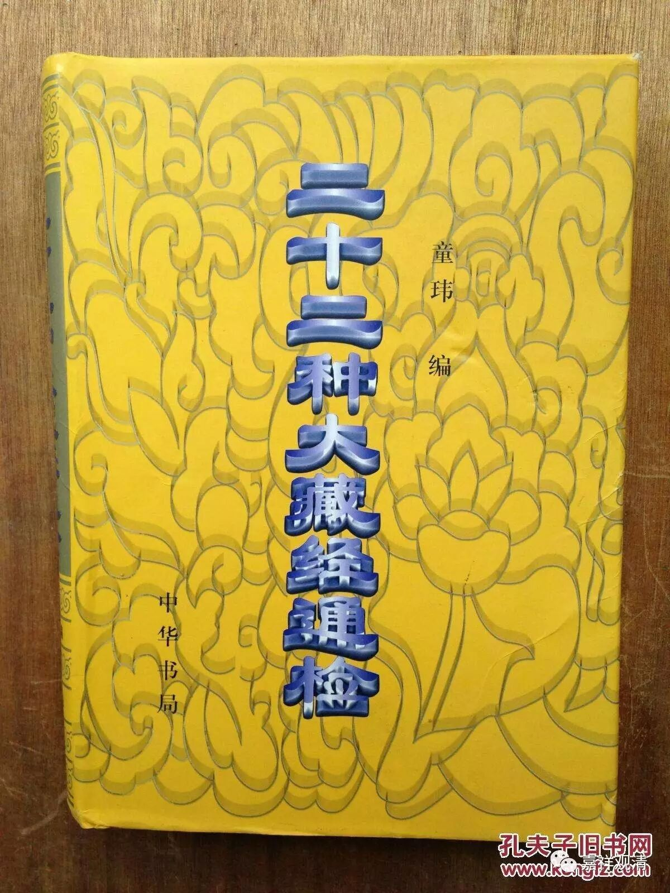

关于《止观门论颂》

《大正藏》收录此书，其初，作：

**“止观门论颂一卷 **

** 世亲菩萨造 **

** 三藏法师义净奉诏译”**

全论之后，说：

** “止观行门七十颂”**

然《二十二种大藏经通检》录作：

** “《止观门论七十七颂》一卷**

** 天亲菩萨造**

** （唐）义净译**

** 又名：《止观门论颂》”**

这里有几个问题：

1、到底是“七十颂”还是“七十七颂”？

答：全论数下来，共七十七颂，而且其余藏经都说“七十七颂”——《大正藏》误！

2、“义净奉诏译”还是“奉制译”？

答：义净法师的其余同时或前后译作皆作“奉制译”，而且其余藏经本论皆作“奉制译”——《大正藏》二误！

3、本论当作《止观门论颂》，还是《止观门论七十七颂》？

答：早期的《一切经音义》、《开元释教录》、《贞元释教录》皆作“《止观门论颂》”，唯有明代藏经作“止观门论七十七颂”，此“七十七”应当是后期加的。故本论当作《止观门论颂》。

然印度经论，原是在论文最后书写书名的，故此论亦可作“《止观行门颂》”——这应该是翻译的差别了。

4、“天亲”还是“世亲”？

答：“天亲”、“世亲”本来是一个人名的不同译法，但《开元录》、《贞元录》及之后的藏经皆作“世亲”，似乎当署名“世亲”跟好些。

