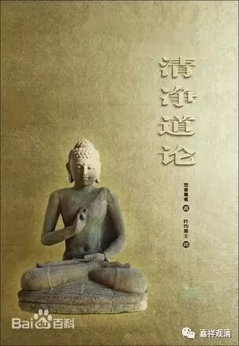

关于“五禅”

《清净道论·说取业处品》“定有几种”中，有提到五法、五禅。其元亨寺版作：

**“〔初禅、第二禅、第三禅、第四禅、第五禅〕于五法，在〔第三之〕四法中说第二禅，是唯由超越寻为第二〔禅〕，由超越寻、伺为第三〔禅〕，当知如斯二种之别为第五禅。可成彼等〔五禅〕支，有五定。当知由如斯五禅支而有五种。”**

此处，元亨寺版至少在句读上有误，叙述上有混乱。

我们来看叶均版《清净道论》：

** **

** “（五）（五法）（初禅、第二禅、第三禅、第四禅、第五禅）于五法中，犹如前的（第三种）四法之中，这里仅以超越于寻为第二禅，以超越寻与伺为第三禅，如是（将四法中的第二）分为二种，当知便成五禅。依彼等（五禅）的支而有五定。如是依五禅而为五种。”**

这是说，也有“五禅”的说法，其“五禅”成立之差别，如下：

初禅：具寻、伺、喜、乐、定五支；

二禅：具伺、喜、乐、定四支；

三禅：具喜、乐、定三支；

四禅：具乐、定二支；

五禅：具舍、定二支。

也就是，《清净道论》论及的“五禅说”，是将通常“四禅说”的初禅，一分为二：1、有寻有伺；2、无寻唯伺。“四禅说”的二、三、四禅则顺延而成为“五禅说”的三、四、五禅——实际是以“五支”而立“五禅说”的。

五支

四禅说

五禅说

寻、伺、喜、乐、定

伺、喜、乐、定

初禅

初禅

二禅

喜、乐、定

二禅

三禅

乐、定

三禅

四禅

舍、定

四禅

五禅

叶均版加字“如是（将四法中的第二）分为二种”有误，应说“如是（将四法中的第一）分为二种”。

元亨寺版，看起来是误读、误译了。若欲仅改标点，可以略近一些，则当作：

** “〔初禅、第二禅、第三禅、第四禅、第五禅〕于五法，在〔第三之〕四法中说。第二禅，是唯由超越寻为第二〔禅〕，由超越寻、伺为第三〔禅〕，当知如斯二种，之别为第五禅。可成彼等〔五禅〕支，有五定。当知由如斯五禅支而有五种。”**

这样改正《元亨寺版》的标点，仍有不妥之处。

清案：

严格来说，“无寻唯伺”要算中间定，不能算初禅，但一般又说大梵天是初禅天，而得“无寻唯伺”之三摩地，所以因此，而在这上面分出了“四禅说”、“五禅说”吧。

