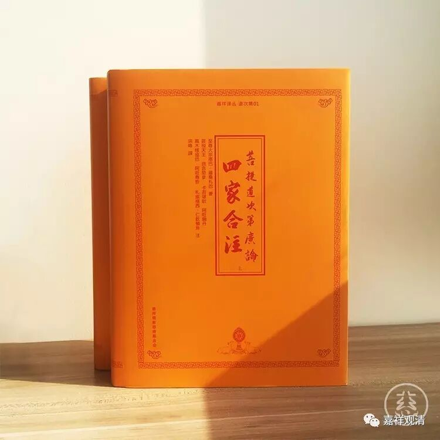

**《六门教授习定论》005（下）**

** “有依，谓是三定：一、有寻有伺定；二、无寻唯伺定；三、无寻无伺定。”**有寻有伺定是初禅，无寻唯伺定是初禅的中间定，无寻无伺定是二禅（含）以上的。这是三种定，基本上这三个——有寻有伺定、无寻唯伺定和无寻无伺定就把所有的禅定都包括在里面了。

** “修定人者，谓能修习奢摩他、毗钵舍那。”**这里的意思是“得果”。我们这里是讲的是《六门教授习定论》，那就是得到了奢摩他和毗钵舍那。修定人，能修习奢摩他、毗钵舍那，实际上按照后面的说法，这里说的是修定人得到的果。这里的科判是讲“得果圆满”，“修定人”是“得果圆满”，得到了奢摩他和毗钵舍那。

** “若人能于解脱，起愿乐心，”**起愿欲这样的心。这里的“解脱”在后面会讲，有三层解脱。这里等于是又把前面的内容重新复述一遍。如果有人，能够对解脱起愿乐的心，** “复曾积集解脱资粮，”**这个是第二门。** “心依于定，”**心依于禅定的基础吧。** “有师资等三而为依止，”**依靠师资、所缘、作意的圆满。** “有依修习，”**依靠修习各种禅定。这里用的是有寻有伺定、无寻唯伺定和无寻无伺定，如果一定要把“三定”改成四禅八定，那也是完全可以的，没有问题。

** “有依修习，由习定故，能获世间诸福及以殊胜圆满之果。”**修定能获世间诸福，实际上是属于世间的福业、非福业、不动业这三业当中的不动业，因为它是升色界、无色界天的，总比我们世间的苦要好。所以，它说** “能获世间诸福”**。** “及以殊胜圆满之果”**，如果修出世间定的话呢，就获得殊胜圆满的果位。

这段文字里提到的“世间诸福”，就是色界、无色界的增上生。修定的果报是在上界嘛，不过初禅位未到地定那就不是，还在欲界。如果分福业、非福业和不动业的话，初禅以上的定都是不动业了，只有初禅未到地定还算是福业。** “能获世间诸福及以殊胜圆满之果”**，泛泛讲，“世间诸福”和“殊胜圆满之果”也就是我们通常讲的“增上生”和“决定胜”。这里前后文的限制，“世间诸福”则仅指由禅定得来的福报。

** “先作如是安立次第，故名总标。”**一开始先把科判的总标讲一下，有这样的六门。

第一科，求解脱。“求解脱”对应《瑜伽师地论·修所成地》的这段，就是修处所。我们比较习惯的说法就是自圆满和他圆满，自圆满就是** “人、生中、根具，业未倒、信处”**，他圆满就是** “佛出、说正法，教住、随教转，有他具悲悯”**。这段《菩提道次第广论》“十圆满”的相应文字引自《瑜伽师地论·修所成地》：

“云何生圆满？当知略有十种，谓依内有五，依外有五，总依内外合有十种。

云何生圆满中依内有五？谓众同分圆满、处所圆满、依止圆满、无业障圆满、无信解障圆满……

云何生圆满中依外有五？谓大师圆满、世俗正法施设圆满、胜义正法随转圆满、正行不灭圆满、随顺资缘圆满。”

广告插播：《广论四家合注》，淘宝·慈慧文化有结缘，欢迎学习，辗转流通！

