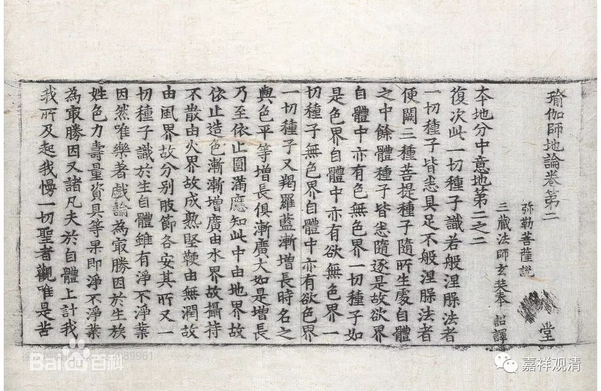

**《广论》“十圆满”的出处**

《菩提道次第广论》之释“十圆满”：

“第二、圆满。分二：

五‘自圆满’者，如云：“人生中根具，业未倒信处。”……此五属于自身所摄，是修法缘，故名自满。

五‘他圆满’者，如云：“佛降说正法，教住随教转，有他具悲愍。”……此五属于他身所有，是修法缘，故名他满。”

《广论》之十圆满分“自他圆满”出自《瑜伽师地论》，而且在《瑜伽师地论》不同场合、不同名目多次出现，或谓“自他圆满”共十，或举“内外圆满”满十，如《瑜伽师地论》卷二十一《声闻地》：

“云何自圆满。谓善得人身。生于圣处。诸根无缺。胜处净信。离诸业障。……唯由如是五种支分自体圆满。是故说此名自圆满。

云何他圆满。谓诸佛出世。说正法教。法教久住。法住随转。他所哀愍。”

及卷二十二：

“……自他圆满……若自圆满、若他圆满……”

又见《瑜伽师地论》卷二十《修所成地》：

“云何生圆满？当知略有十种，谓依内有五，依外有五，总依内外合有十种。

云何生圆满中依内有五？谓众同分圆满、处所圆满、依止圆满、无业障圆满、无信解障圆满……

云何生圆满中依外有五？谓大师圆满、世俗正法施设圆满、胜义正法随转圆满、正行不灭圆满、随顺资缘圆满。”

此《瑜伽师地论》之十圆满，若“自他圆满”，若“内外圆满”，虽科别不同，文字稍异，而立意无别。文繁不录。

