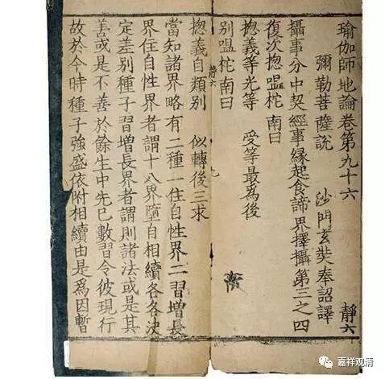

**《六门教授习定论》006（下）**

你看，这也是《瑜伽师地论》里面的一段，是这么说的，是吧？好，到了“修所成地”里面又给了新的名字。我把这些名字念一念，你们听一听。** “云何生圆满中，依内有五？谓众同分圆满、处所圆满、依止圆满、无业障圆满、无信解障圆满。”**这是内圆满的。外圆满的呢？又有五个新名字了。** “云何生圆满中，依外有五？谓大师圆满、世俗正法施设圆满、胜义正法随转圆满、正行不灭圆满、随顺资缘圆满。”“**随顺资源圆满”的“资”“源”就是指资粮和因缘。好，这是第二种说法。

我再来给你们看第三种说法，应该是在《种姓地》当中。** “四因缘故不般涅槃。何等为四？一、生无暇故；二、放逸过故；三、邪解行故；四、有障过故。”**这个“** 四因缘故不般涅槃**”是从反面来讲的，倒过来，和五内圆满相应。1、“生无暇”，反过来，就是生有暇，对应“生中”；2、“放逸过”，反之就是“无放逸过”，对应“业未倒”，没有大的恶业现前；3、“邪解行”，反之就是“正信”，对应“信处”；4、“有障过”反面就是“无异熟障”，对应“根具”和“人”。前三个一一对应，第四个对应两个，加起来就是五个。

《瑜伽师地论》还有一个地方，也是有五个“自圆满”，内容完全一致。** “云何自圆满？谓善得人身、生于圣处、诸根无缺、胜处净信、离诸业障。”**这里是五个自圆满：一、善得人身；二、生于圣处；三、诸根无缺；四、胜处净信；五、离诸业障。这也是一种说法。另外，在《决择分》当中还有其他的说法。

这是《瑜伽师地论》在不同的科判下面的展开表述，但是讲的内容是一样的。有的时候是从不同的角度来讲同一件事情，也有的时候是讲不同的事情但涉及到相同的内容，然后用不同的说法来讲。应该说，这两种情况都有。比如说，第二十卷和第二十一卷本身是在讲不同的事情，前面一卷在讲“修所成地”，后面一卷在讲“种姓地”。这两卷中涉及到的内容一样，但说法就不同。还有一种情况，比如在“决择分”里面，“决择分”是解释“本地分”的，它里面有一段就是把同一个内容再来详细解释一遍。

其实两种说法的内容还是完全一样的，就是前后的次序可能会不一样，例如“自圆满”和“内圆满”，第四、第五，次序颠倒了一下。

