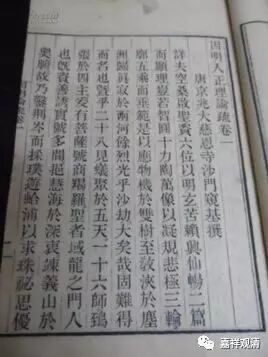

“宗依”里两个部分的五组称谓

《因明入正理论》：

**“此中‘宗’者，谓‘极成有法’、‘极成能别’，差别为性，随自乐为所成立性，是名为‘宗’。如有成立‘声是无常’。”**

这是说，“宗”当中分两个部分：1、有法；2、能别。“极成”的意思是终极成就，在这里是“共许”，即立敌双方都承认、认可的意思。

“宗”当中的这两个组成部分，见有五组称谓，即：1、“体”“义”；2、“自性”“差别”；3、“有法”“法”；4、“所别”“能别”；5、“前陈”“后陈”。如基大师《因明入正理论疏》说：

** “一切法中，略有二种：一、体；二、义。且如五蕴，色等是体，此上有漏、无漏等义，名之为义。**

** ‘体’之与‘义’，各有三名。**

** ‘体’三名者：一名‘自性’，《瑜伽》等中古师所说‘自性’是也；二名‘有法’。即此所说‘有法’者是；三名‘所别’。如下‘宗过’中，名‘所别不成’是。**

** ‘义’三名者：一名‘差别’，《瑜伽论》等古师所说‘差别’是也；二名为‘法’，下‘相违’中云‘法自相相违因’等是；三名‘能别’，则如此中名‘能别’是。**

** ……‘前陈’名‘自性’，‘后陈’者名‘差别’……”**

参见下表：

宗依

初

后

1

体

义

2

自性

差别

3

有法

法

4

所别

能别

5

前陈

后陈

例：声（是）无常

声

无常

 

