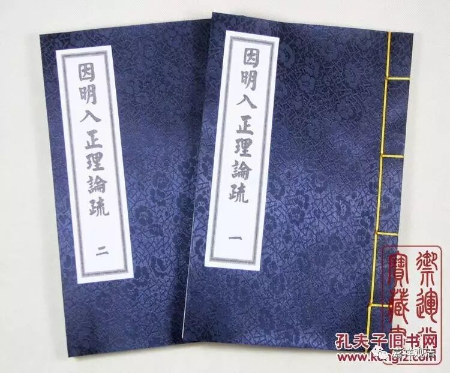

**《六门教授习定论》讲记007（上）**

不过，我以前也讲过，唯识派还有一个特点，就是他有时候会采用一种“互见”的方式，前面说到了，后面就不说了；反之也是一样——后面说了，前面不说，各说一半。你看《因明入正理论》，话就很少，但是这话很少的背后又有非常多的内容。比如说，前面讲“极成有法”，后面就讲“极成能别”。他的意思是，后面的就是“法”，他就直接讲“能别”，不讲其他了，而前面就是“所别”，也不讲了。他的方式就是用两个“互见”的形式，用两个词讲了四件事情。如果再加上一个词“差别”的话，他就有可能用三个词讲了六件事情。这也是唯识派的一个习惯。（见下表。《因明入正理论》最初只出现了黑体字的两个词：“有法”、“能别”，实际带出了另两个“法”、“所别”，而这两个词隐而未显。）

宗依

初

后

1

体

义

2

自性

差别

3

** 有法**

法

4

所别

** 能别**

5

前陈

后陈

例：声无常

声

无常

我以前也开过玩笑嘛，《大话西游》的编剧说不定还真是看过唯识派的论典呢！你看《大话西游》里的唐僧，一会儿话少，一会儿话多。话多的时候就是反复讲，反复讲，而且话多的特点和这些论典的特点差不多的。所以学唯识的话，有时候就是会有点晕。假如说，你先看唯识的著作感觉头大的时候，再一看中观：“哇！太爽了！”唯识就像禅宗里面讲的“老婆心切”，你问他什么问题，他都回答的。而中观呢，不是这样的。比如说中观派的《大智度论》里面，很多人来提问，龙树菩萨的回答，用上海话来说就是“蛮煞根的”，后来我也经常用龙树菩萨的这个习惯来回答别人的提问。

我举个什么例子来说明呢？比如说，有些人会问：“为什么这里是分五个，而不是分六个呢？”如果按照弥勒一系或者唯识派的习惯，他会跟你讲各种理由，为什么要分五个而不能分六个，他会跟你讲得很细。有时候又会出现分六个的说法了，那就要问：“为什么这里是分六个而不能分五个呢？”唯识派就会回答说这是从另外的角度来讲，而且会讲得很圆满，再给你一个新的说法。

那么，中观派的龙树菩萨一般会怎么回答呢？他说：“你这根本就不是问题嘛！我分了五个，你就会问‘为什么分五而不分六’，如果我分七个，你又会问‘为什么分七而不分五’。这是没问题里面找问题嘛！”好，这就算完了，这个问题他就不回答了。

再比如说，有人问：“为什么人是两个眼睛呢？”唯识派可能会找理由：“两个眼睛长得比较帅。”而中观就会回答说：“很正常嘛，人就是有两个眼睛，这又有什么可问的呢？就长成这个样子了，‘法尔如是’，不就行了吗？如果长了三个眼睛，你还是照样会问‘为什么长三个眼睛’。”

中观派比较喜欢剪断截说，而唯识派就比较喜欢唠叨。一开始我也没这感觉，因为我虽然跟唯识派接触，但是不太听唯识派的兄弟讲课。后来我听了某个法师一次课，立即就明白了为什么大家学唯识会学成这个样子。这个讲课的人也确实蛮用功的，他讲唯识的时候的确讲了很多东西，但是出现一个什么情况呢？就是本来要讲一个事情的，结果越讲越多。

比如说，类似于我今天的讲课，本来是讲十圆满的，结果继续讲下去的时候，十圆满还没讲清楚，就出现了一大堆新的内容，甚至连“三性三无性”都出现了。然后呢，又开始分析为什么是“三性三无性”。哇！越讲越多。我在听他讲课的时候，本来他是在讲一个东西，后来发现他不是涌出三个新名词，而是一下子涌出了三、五十个新名词，最后他把自己都讲晕了，看黑板：“呃，讲到哪儿了？”就有这种情况发生。所以我知道了，为什么汉人不喜欢唯识，为什么唯识在汉地好像混不下去——太啰嗦了。

还有一个什么情况呢？也是因为太啰嗦了，所以一般人看着看着，被带晕了，总结不出核心内容来了。如果你不是非常聪明的人，你就不能把里面的理路整理出来。线团太多了，太难扯了，拉不出来。一拉就是一大串，而且下面还跟着一大堆。当时我听他讲经的时候，我也觉得烦，这样的唯识我也不要学了，烦死了。本来是“百法”，被你一拉一扯，一千个法都不止。《现观庄严论》也就一千三百多个法相，你却是一个“百法”就能拉出几千个法相——烦死了。按照这种方式，刚才讲的十圆满完全可以拉出四十个法相来，就变成四十个东西了。你如果每个都要背的话，“众同分圆满”、“依处圆满”……怎么吃得消啊？我觉得这些东西就不用背了，你背一个就够了，“人生中根具，业未倒信处”，把这个背下来就可以了。

