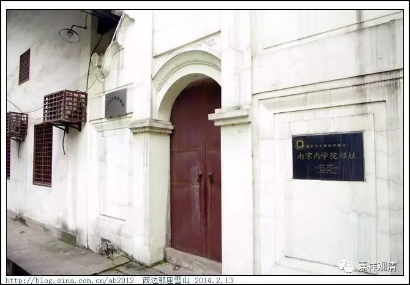

**江津支那内学院旧址**

** 《六门教授习定论》讲记008（上）**

唐末章疏的流失，其实不单纯是唯识宗和中观宗的问题，天台宗也有这个情况。但是呢，天台宗从宋代中晚期开始，就有经典从日本和朝鲜流回中国了，所以他们散失的章疏重现得比较早。于是，天台宗马上就出现了山家、山外两个派系，他们开展了一些文字的整理工作，算是强心针打得比较早吧。

那么，唯识和中观的章疏找回来了之后呢，杨仁山居士先是捐出自己的宅子，成立了“金陵刻经处”，后来又成立了相应的教学机构，最早是办僧伽培训班，后来是支那内学院。天台宗的谛闲法师是当时培训班的教务长……既然唯识的章疏成建制地出现了，大家就方便开始学习和研究了，先做校勘，句读，再学习、研究……就把王恩洋先生、吕澂先生……这些人给培养出来了（其实吕澂先生本来是搞美术的）。

在那个年代，只要你肯花精力下去，玩什么都可以玩得很出彩。而且，这些大师们能够玩得如此出彩，同学好友也都是一时的社会精英——梅光羲，著有《相宗纲要正编》和《续编》，他是民国早年的财政部部长；胡子芴，法尊法师的主要施主，做到山东省主席；汤芗铭，译有宗喀巴大师的《菩萨戒品释》等，北洋海军领袖，早在吴佩孚还做旅长的时候就已经是海军中将了；陈铭枢，字真如，有和吕澄、熊十力往还信函，讨论唯识义，有《真如做疏所缘缘义》等论稿，是十九路军军长、国民党上将、广东省主席；游侠，后来是国民党海军少将参谋长（中共秘密党员，渡江战役时是江阴要塞起义重要人物）；欧阳竟无的大儿子也是中山先生的左膀右臂，一度在国民党军界排名第五，高于蒋介石，后来因中山舰事件下野，抗战时期为海军中将，武汉会战后被蒋介石以避战为由毙掉了（这里头有很多八卦，不讲了）……

搞研究的话，有资料都好说，没书、缺少资料就没法做一些文献研究（所以我们要搞图书馆，馆藏要丰富）。比如明代的时候，当时僧俗界也有研究唯识的一些著作，但是这些作品拿到现代来，基本没法看……也是可怜，他们没有可以依傍的东西，虽然也有《成唯识论》等等，但是唐人的注疏当时都失传了，只能靠自己硬学。

