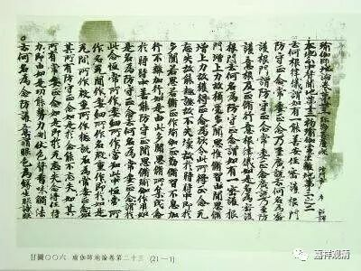

二、中有寿量之唯识说

《俱舍论自释》取《婆沙》正义，谓“中有寿量无定限”，而大乘（唯识）则不然。大乘唯识宗关于中有之寿量，同设摩达多（寂授），并融合了世友说，谓，七日一死生，极久不过七七四十九天。如《瑜伽师地论》卷第一：

**“又此中有，若未得生缘，极七日住；有得生缘，即不决定；若极七日未得生缘，死而复生，极七日住。如是展转未得生缘，乃至七七日住，自此已后，决得生缘。”**

《瑜伽师地论遁伦记》解释说：

** “七日一死，寿势颓败（“败”，当作“故”），乃至极经七七日住，必得生处。”**

基大师《瑜伽师地论略纂》：

** “（第）十一，（中有）生时分限：七日一死，寿势颓故；极经七死，必得生处，业必熟故……”**

都说最多四十九天，同寂授论师；并说七日死生，则通世友尊者。

无著论师《阿毗达摩集论》谓“极住七日，或（有）中夭，或时移转”，似同《俱舍》之第一说和第三说，但安慧论师之《集论》注解《阿毗达摩杂集论》中则更加解释：

《阿毗达摩杂集论》：

** “极住七日，或有中夭，或时移转……‘极住七日，或有中夭’者，此约速得生缘者说；若过七日不得生缘，必定命终，还生中有，如是展转，乃至七返，更不得过。”**

此同《瑜伽》，谓“七日”“七返”“更不得过”，也是最多四十九天的意思。（另外，按基大师所说，四十九天，是按人道来算的，不是按天道来算的。）

《瑜伽》中有寿量说，被格鲁派所继承，宗喀巴大师在其《菩提道次第广论》里说：

** “寿量者，若未得生缘，极七日住；若得生缘，则无决定。若仍未得，则易其身，乃至七七以内而住——于此期内定得生缘，故于此后更无安住。堪依教典悉未说有较彼更久，故说过此更能久住，不应道理。”**

其《菩提道次第略论》也说：

** “中有寿量：若未得生缘，极七日住；若得生缘，则无固定；若仍未得，则易其身，乃至七七以内而住——于此期内定得生缘，故于此后不复安住。”**

其中中有寿量，都和唯识派立论一致。此说为后来格鲁诸大师所沿用，《基位三身》里也说中有时长最多四十九天，按人道的“天”的时间来计数。

《掌中解脱》谓中有寿量最多四十九天，但按下一世投生处计时——这是很少见的说法。

