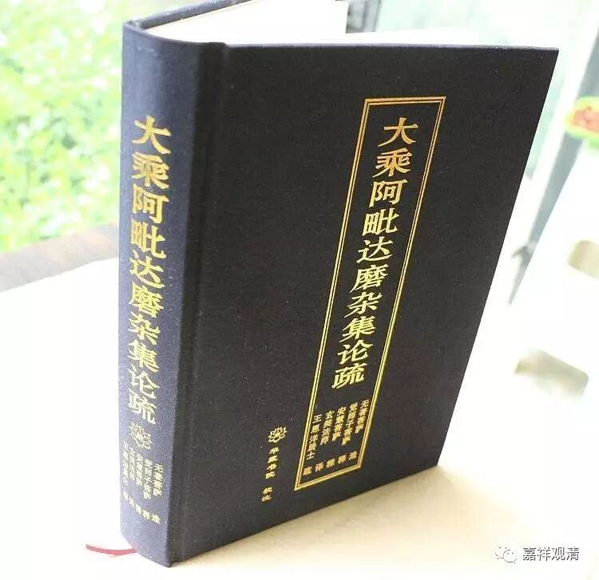

《杂集论》归敬颂之“自他并利所依止”义

《杂集论》归敬颂曰：

**“诸会真净究竟理，超圣行海升彼岸，**

** 证得一切法自在，善权化导不思议，**

** 无量希有胜功德，自他并利所依止，**

** 敬礼如是大觉尊，无等妙法诸圣众。”**

今释“自他并利所依止”义。

《杂集论》长行释此，谓：

** “‘自他并利所依止’者，显差别义。谓如来受用、变化、自性身，如其次第，自、他、并利所依故。所依者，身义、体义，无差别也。**

** ‘自他并利所依’者，就胜而说。谓：**

** 受用身，自利最胜——处大会中，能受第一、广大、甚深法圣财故。**

** 变化身者，他利最胜——遍于十方一切世界，能起无间，犹工巧业等诸变化事，建立有情所应作故。**

** 自性身者，谓诸善逝共有法身——最极微细，一切障转依真如为体故；于自他利并为最胜，由证此身得余身故。**

** 此三佛身是差别义。”**

这是说，“自他并利”分三：1、自利；2、他利；3、自他并利。次第与佛的三身——受用身、变化身、自性身相应，大致相当于报身、变化身、法身（但这里的受用身是指自受用身，和一般说“他受用身”的报身略异）。

就主要来说，（自）受用身，自利为主；变化身，利他为主；自性身（法身）为余二身的基础，故兼有自他两利的功德。

颂文此处是从佛的三身的差别来兴赞。

这里要说的是，《杂集论》归敬颂之“自他并利”，不是按一般单纯从字面所理解的“二利”而已，而是分三，一个“利”字要用三次——自利、他利、并利。这和一般读法不同。

唯识译典里很多类似的用法，大家要小心看上下文、参考可靠的注释。另外，这类文献里虚词实化，实词虚化的例子也很多，大家阅读的时候要留意，不要以今天的白话文的习惯和语法来解读。

