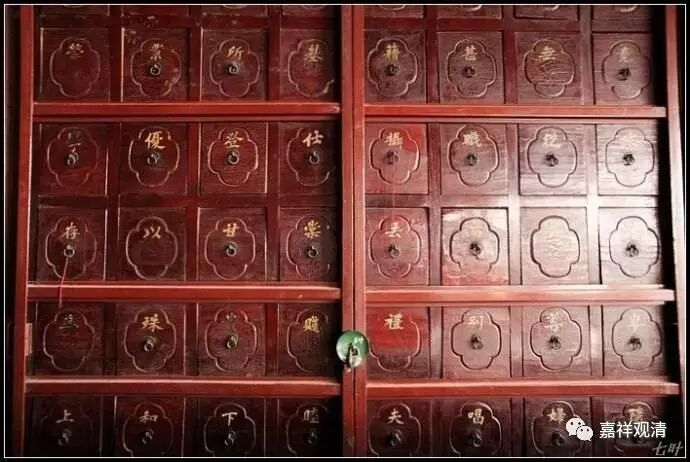

道高初住，德跨八恒

有问：

道宣律师《<离垢慧菩萨所问礼佛法经>序》云：“道高初住，德跨八恒”，何解？

答：原文上下文是“有离垢慧菩萨者，道高初住，德跨八恒……”，这是在赞叹本经发起提问的“离垢慧菩萨”。“初住”，这里指的是菩萨初地。“初住”是“旧译”，虽然新译之“初住”和“初地”完全不同，但行文时经常用“初住”来代替“初地”。“道高初住”意思是（指离垢慧菩萨是）地上菩萨、圣者菩萨。

“八恒”比较难解，其实是缩略语，意思是“八恒河沙诸佛”。

《四分律行事钞简正记》：

**“十地、等觉已去，为第四依，供养八恒河沙佛。”**

《大乘义章》：

** “第四依人于八恒河沙佛所发心，断诸烦恼，舍于重担，逮得己利，所作已办，欲成佛道即能现成，随人所乐悉能现化，得自在智，广为他说……”**

《瑜伽师地论遁伦记》：

** “如《涅槃》说，初依菩萨供五恒佛；初地至六地，是第二依，值六恒佛；七、八、九地为第三依，值七恒佛；第十地为第四依，值八恒佛。”**

这里，“德跨八恒”，是指离垢慧菩萨是十地上菩萨，或者说超越十地。

“道高初住，德跨八恒”，是称赞离垢慧菩萨不仅超越初地，而且已满十地——这是非常高的赞美了，虽然经文本身并不容易读出离垢慧菩萨有如此高的证量，但，《序》文溢美也是常有之事，是文学而非义理也。

又，《遁伦记》“如涅槃说”的“涅槃”，是指《涅槃经》及世亲《涅槃论》，并不单指一本。所述也不是引文，仅是述义。

