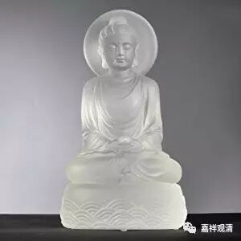

**《六门教授习定论》009（中）**

** “此复云何？”**这里边的** “此复云何”**就像很多经典中的“何以故”的意思。有时候，“何以故”并不是完全按照文字上的“为什么呢”的意思，它可以只是发起一个提问。有时候它说的是为什么，但实际上给的答案是分类、差别。唯识的经典里面这个情况特别多。《金刚经》里也有“何以故”，但它讲的其实不是为什么，它只是提出一个问题，相当于是一个设问，并不是一个疑问句。

** “此复云何？”**可以说，是哪些呢？二障是指哪些呢？** “惑种即是烦恼障自性，一切种即是所知障自性。”**这个** “自性”**，就是指本身。也就是说，** “惑种”（障）**指的就是烦恼障，** “一切种”（障）**就指的是所知障。如果你找到了这个** “惑种”**，最终它指到哪里去呢？它指向的就是烦恼障。如果你找到了** “一切种”**，它是什么呢？就是所知障。它就是这个东西，selfbeing，就是这里** “自性”**的意思。

** “又一切种者，即是二障种子，能缚二人。”“一切种者”**，这要看看其他版本会不会是“一切种等”。这次我没有做校勘，今天也有人问过，这个版本还是有一些文字上的问题。我以前稍微做过一些改动，这次也没在这里面很仔细地标出来。** “又一切种者，即是二障种子，能缚二人。”**这里面主要是讲的是** “二障种子”**能缚两类人，能够绑住两类人。去掉了这个** “二障种子”**，就解脱了。** “能缚”**的是什么呢？是** “二障种子”**。

** “烦恼障种子能缚声闻。”**二障种子当中，有一种是烦恼障种子。说它能缚声闻，并不是说它不能缚菩萨，意思是说声闻主要断的是烦恼障的种子。断除了烦恼障种子，就成为声闻的罗汉或者缘觉的罗汉。从这个角度上来讲，烦恼障种子能缚声闻。

** “一切种子能缚菩萨。”**这是什么意思呢？这是从别的角度，或者从殊胜的角度来讲。其实，烦恼障也能缚菩萨的嘛，对不对？这里是从个别的来说，从特别的来说，一切种子——所知障种子，能缚菩萨。要断所知障种子的，或者说以所知障为主要所断的，那就是菩萨。

** “由与声闻、菩萨为系缚故。”**这就是上面所讲的** “能缚二人”**。这二障种子系缚谁呢？系缚声闻和菩萨。这里的声闻，其实也包含了两种——声闻和缘觉。因为主要的是声闻比较多，所以这里就用了声闻。唯识里面也是经常有这样的情况，有时候就大部分而言的内容，它会直接讲是“一切”，这个“一切”并不是究竟的一切，不是全部的一切，而是大部分的一切。有些经典会用“诸”这个字，但并不是指全部的。或者唯识里面还有讲“一切皆是……性”，但这个“一切”不是指全部的，用藏传的词来说，这个不是周遍的。这是早、中期的阿毗达摩常见的用法——所述并不要求周遍。

