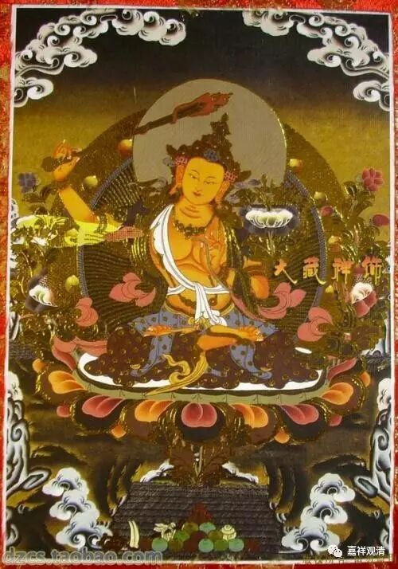

**《六门教授习定论》009（下）**

** “云何此二解脱差别？”**那么，声闻乘、缘觉乘——小乘的解脱，和大乘的解脱，区别在哪里呢？** “谓声闻人，习气未除，”**我们说，声闻人不断习气，或者说主要不是断习气。** “断烦恼障而证解脱，”**声闻人断了烦恼障就可以证得解脱了。** “唯佛世尊能总除故。”**因位上是菩萨，果位上就是佛。佛能总除什么呢？一个是声闻所断的烦恼障，一个是特殊所断的所知障，佛是究竟断除的这二障的。这就是两种解脱的差别——小乘唯以烦恼障为断除的对象，而大乘主要以所知障为断除的对象。当然，以断所知障为主要，就说明大乘是两个障都要断的，二障是全部断除的。

** “云何习气？”**那什么是习气呢？习气，刚才讲过了，就是熏“习”的气“分”，造出了这个词叫“习气”。** “彼惑虽无，”**什么是习气呢？这个有情，虽然他的惑、烦恼已经没有了，** “所作形仪如有惑者，”**他所造作的行为表现，好像有烦恼一样。他的烦恼其实已经没有了，但是他的行为表现好像有烦恼一样，** “是名习气。”**这个就是他所熏“习”的烦恼的“气”分。就好像香已经没有了，但是香的味道留在衣服上了。这一生的烦恼他已经断除了，但是上一生的烦恼所引发的烦恼的习气还在。这个习气不作为声闻的主要所断。比如运动的物体，外力去除之后，加速度（比作烦恼）没有了，但速度（余习）还有。

** “此中应言：”**这里面应该怎么说呢？应该说：** “若惑虽无，”**如果他的烦恼虽然没有了，** “令彼作相如有惑者。”**这个“令”不是让的意思，这里的意思是看到他的造作的行为、表象、特征、形象，好像有烦恼一样。这里一定要看清楚，先是没有烦恼的，但表现为像有烦恼一样。** “此言”——**在这里用这样的文字来表述。什么文字呢？** “‘作仪如有惑’者”——**他的造作的行为、表象、特征、形象好像有烦恼。** “此言‘作仪如有惑’者，即是于因说果名故，”**为什么说是** “于因说果名”**呢？从因上来说是有惑的，但是从果上来说是没有惑的。此时，惑是没有的，仅仅** “如有惑”**，所以说是** “于因说果名”**。** “彼谓声闻、独觉。”**这就是声闻、独觉。

** “未知此是谁之习气，”**他看起来好像有烦恼，不知道是谁的、什么的习气呢？** “谓是前生所有串习之事，”**以前所习惯的、串习或者曾习的事情，不是仅仅一次，而是经常所做的事情，也就是我们的烦恼。这是前生所串习的烦恼的习气。** “尚有余气，”**还有些表现，有余下来的气分。** “今虽惑尽，”**现在虽然烦恼已经断尽了，** “所为相状”**，他所造作的形象、特征、表象、相状，** “似染形仪，”**好像有染污。这个染污其实包括了善的和恶的——善也可以是染。这个染就是烦恼，烦恼染污他的形象和仪表。** “名为习气。”**所以把它叫做习气。

** “若能除断，”**如果能够断除这个习气的话，** “与此不同。”**这个“此”应该是声闻缘觉。** “应云”**，这个时候应该说，** “若彼习皆无”**如果习气都没有的话，** “不作仪如惑。”**如果烦恼障断完以后，习气也断掉，所知障也断掉的话，** “不作仪如惑”**，就像佛一样，他不会表现为行为上好像有烦恼一样。这个就是相对于前面的文字所说的，假如烦恼障和所知障都断完的话，是没有‘好像有烦恼’的表现的。是完全的清明显白。

