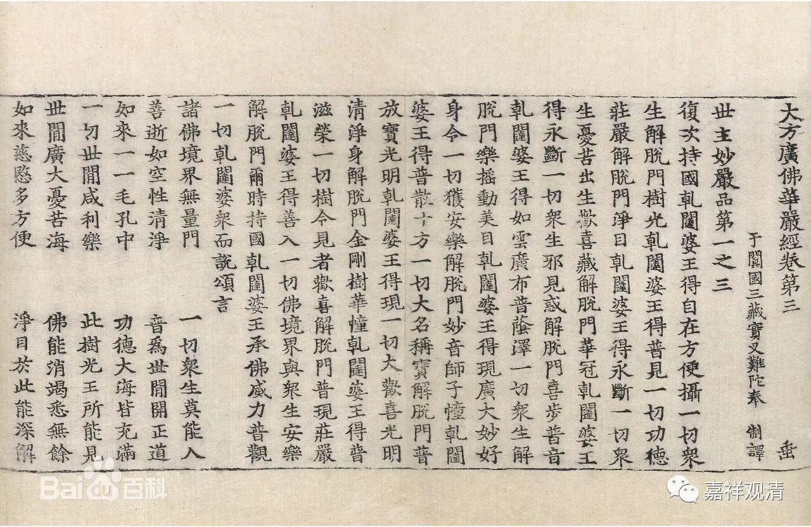

**每日一偈·华严偈钞**

2017-8-1

佛是福田功德海，能令一切离诸恶；

众生有垢咸净治，乃至成就大菩提。

——集《华严》句

2017-8-2

法性本空寂，无取亦无见；

性空即是佛，不可得思量。

2017-8-3

厌苦断集，欣灭修道；

释氏之旨，如是我闻。

2017-8-4

佛身无为，不堕诸数；

观身实相，观佛亦然！

——《华严疏钞》

2017-8-5

佛身三一，权实有别；

爰此空性，法报化殊。

2017-8-6

譬如种种像，画师之所作，

如是一切刹，心画师所成。

2017-8-7

如来善根海，流润诸众生，

起种种方便，引导趣涅槃。

2017-8-8

法无自体，揽缘而生；

本既不生，亦无可灭。

2017-8-9

无边佛刹，重重无尽，

依正圆融，过诸稠林。

2017-8-10

夫万法本净，以其本无生，

诸相皆寂灭，非荡然无存。

2017-8-11

佛无边刹普现身，其土杂染或清净，

或现广大或短小，三昧神变之所成。

2017-8-12

诸法无作用，亦无有体性；

是故彼一切，各各不相知。

——《华严经》

2017-8-13

若有知如来，体相无所有，

修习得明了，此人疾作佛。

——《华严经》

2017-8-14

随其所行业，如是果报生，

作者无所有，诸佛之所说。

——《华严经》

2017-8-15

佛随入一切，世间与国土，

智身无有色，非彼所能见。

——《华严经》

2017-8-16

无生之生，因果宛然；

生之无生，本性寂然。

2017-8-17

智慧无等法无边，超诸有海到彼岸，

寿量光明悉无比，此功德者方便力。

——《华严经》

2017-8-18

世间所见法，但以心为主，

随解取众相，颠倒不如实。

——《华严经》

2017-8-19

若欲求除灭，无量诸过恶，

当于佛法中，勇猛常精进。

——《华严经》

2017-8-20

如人水所漂，惧溺而渴死，

于法不修行，多闻亦如是。

——《华严经》

2017-8-21

如聋奏音乐，悦彼不自闻，

于法不修行，多闻亦如是。

——《华严经》

2017-8-22

譬如大地一，随种各生芽，

于彼无怨亲，佛福田亦然。

——《华严经》

2017-8-23

一切众生心，普在三世中，

如来于一念，一切悉明达。

——《华严经》

这和《金刚经》里说的“佛具五眼，能澈见众生三世心”是一个意思。

2017-8-24

譬如赫日照，孩稚闭其目，

怪言何不覩，懈怠者亦然。

——《华严经》

2017-8-25

智者能观察，一切有无常，

诸法空无我，永离一切相。

——《华严经》

2017-8-26

剃发着袈裟，宜应修圣道，

自余諠杂事，咸为生死因。

——《止观门论颂》

2017-8-27

譬如大力王，率土咸戴仰，

定慧亦如是，菩萨所依赖。

——《华严经》

2017-8-28

发起大悲心，救护诸众生，

永出人天众，如是业应作。

——《华严经》

2017-8-29

如人持日珠，不以物承影，

火终不可得，懈怠者亦然。

——《华严经》

2017-8-30

譬如见导师，种种色差别，

随众生心行，见诸剎亦然。

——《华严经》

2017-8-31

家是贪爱系缚所，欲使众生悉免离，

故示出家得解脱，于诸欲乐无所受。

——《华严经》

