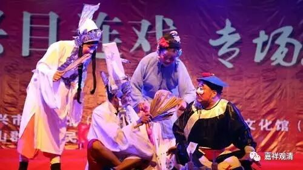
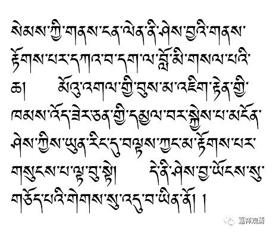

佛欢喜日，聊聊目连母之生处

俗谓七月十五为鬼节，搬出目连救母的故事作为出典，后来更是开出戏曲里的一门“目连戏”。实际七月（八月）十五为僧团安居解夏之日，佛门称为“佛欢喜日”或者“僧自恣日”（“自恣”，义净三藏译为“随意”）。

目连救母故事，出自《盂兰盆经》，但此经流行很晚，亦混不似竺法护译文。此经在明以前一直被质疑，全文疏漏极多，不值一提。其唐宋诸大师皆学通三藏，自不得信受而奉行之。

唐·义净三藏译《根本说一切有部毗奈耶药事》，有目连母故事，谓目连证果后，天眼见其母在摩利支世界，乃持佛力前往……世尊开示后，其女（目连母转世者）得预流果，成女居士——此则目连母转世在摩利支世界为女人，而非俗所谓地狱，更不需“超度”！（因为证预流果必在欲界人天，成女居士则必为人。）《根本说一切有部毗奈耶药事》卷四：

**具寿目连……即以天眼，见其亡母生摩利支世界，见已思念……经七日中，方到彼界。母见目连从远而来……尔时世尊知目连母意乐随眠种性，即便为说四真谛理，令得悟解。彼女闻已，得法见法，证预流果，以金刚智杵摧灭二十萨迦耶山，破有身见由见谛理悉皆破坏，即说三种因缘：“世尊利益于我，此之利益，非是父母、国王、天神、眷属，亦非沙门婆罗门之所能辨。是佛所作，能渴血海，破坏骨山，关闭恶趣门，开示涅槃路，建立人天业。”……（目连母）白佛言：“世尊！我今归依佛法僧宝，为邬波斯迦，乃至命在以来，我常归依，今欲供养佛及目连。”……**

又，安慧论师有《俱舍实义疏》（敦煌本）亦谓目连母在摩利支世界，而为佛所开示（此示阿罗汉有所知障）。其文曰：

** “目连观其母，不知生处。往问佛，佛告：‘汝母生在摩利支世界，三千界外’。”**

（检藏文《俱舍安慧疏》，上文未见。）

据藏传资料，则亦有如上之故事谓阿罗汉不及世尊，引目连不知其母生处作证。如《开示甚深空性真实论•开有缘眼》，谓目连不知其母生于具光世界之地狱。此具光世界，即摩利支世界。

** “……心之粗重者，于诸难达所知之处，心不清明之分，如说目犍连虽以神通长久观照，亦未通达母亲已生于具光世界之地狱。彼则纳入决断所知之障中。”（缘宗法师译）**

传说非一，都说目连母乃生于他方之摩利支世界。

