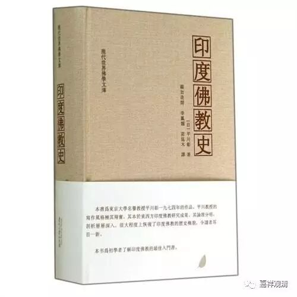

**阿毗达摩是学佛的基础学问**

** **

** 基础的学问：《俱舍论》和《唯识论》**

　　佛教的教理范围很广，十分深奥，仅靠佛教概论是无法理解所有的佛教教理。所以，有必要个别地学习佛教的各种教理。象天台学、华严学是最后才成立的程度高难的学问，在还没有太高的佛学素养情况下，与其一开始就去看难解的这些学问，倒不如先去好好掌握对这些学问有用的佛教基础理论，这才是上策。这种佛教基础理论则是《俱舍论》和《唯识论》。

　　《俱舍论》全称是《阿毗达磨俱舍论》(Abhidharmakosabhāsya)，世亲(Vasubandhu,约400—480)著，略称为《俱舍论》。《俱舍论》讲述了佛教的基础教理，一个一个地去学的话，自然就会掌握其整个思想。其教理的排列也十分巧妙，所以，从头到尾去阅读的话，可以懂得整个佛教的教理。

　　阅读《俱舍论》，要以玄奘翻译的《阿毗达摩俱舍论》30卷为底本，玄奘译本有三种注释，即：
　　普光《俱舍论记》30卷
　　法宝《俱舍论疏》30卷
　　圆晖《俱舍论颂疏》30卷

　　这三部著作都是《俱舍论》的详细注释，他们都是玄奘的弟子，帮助过玄奘翻译《俱舍论》。玄奘翻译的时候，对于内容有说明，这些说明保存在他们的注释里，研究《俱舍论》，必须参照这些注释。《俱舍论》在解释教理的时候，如果遇到说一切有部和经量部的解释有不同的情况，就用对论的形式来说明两者的差异，所以它对于理解部派佛教的教义也是有帮助的。不过，圆晖的《俱舍论颂疏》省略了这些争论，以解释《俱舍论》的偈文为主，便于学习说一切有部的教理。世亲的《俱舍论》问世以后，众贤(Samghabhadra)从说一切有部的立场出发，撰述《顺正理论》80卷，破斥《俱舍论》。所以，应该将二书结合起来读。进而，学习《俱舍论》的思想依据《大毗婆沙论》200卷，除了说一切有部和经量部，还可以学到其他许多部派佛教的教理。这时，应该结合叙述部派分裂和各个部派教义的世友之著作《异部宗轮论》，据此，可以学到部派分裂的历史和部派的教理。为了学习《俱舍论》，可以用旭雅(1821—1891)著的《冠导阿毗达摩俱舍论》30卷作为底本，普光、法宝、圆晖等著述在江户时代虽然木板刊行，现在很难见到，这些都编入了大正大藏经。此外，还有《国译俱舍论》。这是由木村泰贤和荻原云来两博士译成日语，编入了《国译大藏经》的论部。后来又有西义雄博士的日译，编入了《国译一切经》的“毗昙部”。这两本都有详细的注释，要是精读的话，可以自学《俱舍论》。

　　《唯识论》是对世亲的《唯识三十颂》的注释。世亲虽然撰写了《唯识三十颂》，只是作了颂，没有附注释，因此，世亲的弟子们各自作注释。玄奘(602—664)去印度时，得到了《唯识三十颂》的十部注释，回国后，将这十部注释“合糅”，进行编纂，形成了《成唯识论》10卷。十大论师注释中，护法(Dharmapāla,530—561)的注释受到重视。梵文本中，发现有十大论师之一的安慧(Sthiramati)注释的《成唯识论》(Vijinaptimātratāsiddhi)，已经公布于世。汉译《成唯识论》的底本，一直使用的是旭雅的《冠导增补成唯识论》，但是，1940年由法隆寺出版的《新导成唯识论》，则是现在主要用的本子。《成唯识论》注释中有窥基的《成唯识论述记》20卷，而且，又有窥基的《成唯识论掌中枢要》4卷、惠沼的《成唯识论了义灯》13卷、智周的《成唯识论演秘》14卷，合称为“三疏”，这是重要的注释。这些都编入大正大藏经。

　　由于《唯识论》有完整的教理体系，不了解整体的话，其各部分的意义也就不会清楚，可是，通过日积月累把各部分的意思搞清楚，整体的意义就会掌握，所以，理解整个教理并不容易。和阅读书籍相比，去听讲课容易懂。总之，为了获得《唯识三十颂》的整体的轮廓，先宜阅读简单的《唯识论》的解说读本，然后再去进行具体部分的研究。要很好地阅读安慧的梵文注释，把梵文和汉文进行比较，首先要弄懂因转变，果转变，异熟、思量、了别境三种转变。这里就会有“种子生现行，现行薰种子”的问题，而且要搞清楚《俱舍》的五位七十五法的体系与唯识百法体系的差异是怎么产生的。这样，才能懂得立于“外境实有”这一立场的《俱舍论》和认为万法都是“唯识所现”的唯识说之间的差异，而且才能搞清楚以法为有的《俱舍论》和站在以法为空的中观立场的唯识说之间的不同。

不论怎样，对于以法为空的中观佛教没有十分的体会，就去研究唯识佛教，将会所得甚少。所以，在研究唯识之前，有必要先花上十年踏踏实实地去阅读龙树的《中论》注释《明句论》(Prasannapadā)，体会空的含意。空不是用头脑理解的东西，而是要用身体去领会的东西。

