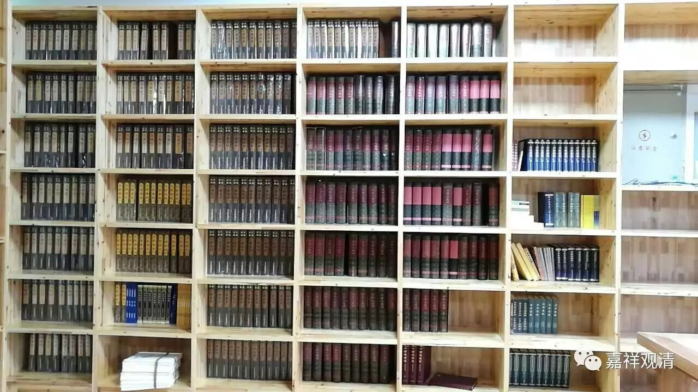

略谈藏经

从事佛教研究，对研究资料要有正确的知识。研究佛教不仅文献资料，书画、雕刻等艺术资料也很重要，这里，只限于文献资料进行叙述。佛教文献收集最广的是汉文大藏经和藏文大藏经以及巴利文三藏。巴利文三藏已有说明，这里谈一谈汉译大藏经、藏文大藏经，可以根据各个版本目录去了解。

　　大藏经在中国用木版印刷刊行是宋太祖的时候，971年成都兴起了大藏经的刊行事业，花费12年，出版了5千余卷的大藏经，这就是最初的宋版大藏经。据此，以往依靠抄本流传的佛教经论得到印刷，进行传播。其后，大藏经屡屡得到了刊行，经论数量也得到增加，1932年出版的“大正新修大藏经”中，有3053部11970卷的经论编辑成85卷得到了出版。其后，大正大藏经又增补图像部12卷，昭和法宝总目录3卷，总卷数达到100卷。部数之所以得到如此增大，中国所出版的大藏经，在增入新的著作时，要得到皇帝的许可，而日本的大藏经出版却没有这种限制。因此，被认为是重要的经论能够自由地刊刻入藏，特别是日本人著述得到了大量添入。大正大藏经85卷中，最初的55卷是印度传来的翻译经论，加上中国撰述的论疏，收有“2184部9041卷”，仅仅这些也比过去的大藏经入藏部数要多得多。而且，从第56卷至84卷的29卷中，日本人的著作收入了537部。第85卷以“古逸部·疑似部”为题，收进了敦煌文书以及疑经类著作。

　　在大正大藏经之外，有卍字大藏经、缩刷大藏经、高丽大藏经、黄檗版大藏经等，但是这些大藏经实际上很难利用。所以，对于大正大藏经，要留意误写之处进行利用，并和《国译一切经》一起参照使用。大藏经中收入了“译经目录”，也有高僧传，依靠这些可以了解到经典的名称、译者、翻译的时间等，因此，理解经典时，有必要和这些典籍进行对照。而且，即使是同一种经典，不同的译者、不同的翻译时代的“异译经典”也很多。关于翻译经论，要调查有无异译，有必要和异译进行比较研究。而且，也有梵文原典、藏文翻译，和这些文献进行比较研究是很重要的。

清案：

一般处理查拣资料，《大正藏》基本够了，确实《大正藏》句读方面是有点问题，但无伤大雅。《卐字续藏》有一些是《大正藏》没收录的文献，可以补其不足。

目前最出色的本子，应该是大陆的《中华大藏经》了，而于初学不便。《大正藏》是句读有点问题，《中华藏》则是没有句读，一般人在阅读上会困难很多。所以，对不是高端研究的人来说，配一套《大正藏》就够了——如果你家书房足够大的话。

上图是我们图书馆的藏经，便是《大正藏》、《卐字续藏》和《中华大藏经》了。还有一套《龙藏》将“转场”运来，正在新定一套《频迦藏》……

