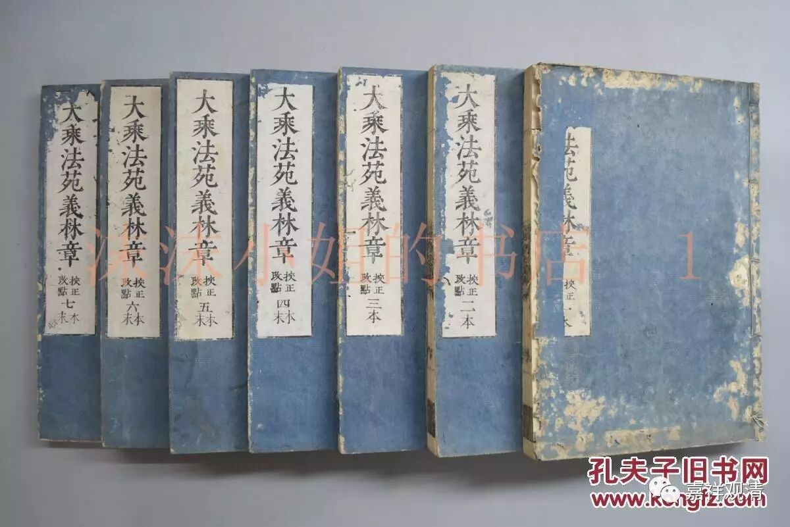

《义林章·六离合释》

《大乘法苑义林章·总料简章》

……

论今释者。西域相传，解诸名义皆依别论，谓六合释。梵云“杀三磨娑”，此云六合。“杀”者，六也，“三磨娑”者，合也。诸法但有二义以上而为名者，即当此释。唯一义名即非此释。一义为名，理目自体，不从他法而立自名；二义为名，理有相滥。故六合释无一义名。初但别释二义差别，后乃合之。如说“佛陀”名为“觉者”，“者”是主义，通于五蕴；“觉”是察义，唯属于智。此别解已，有“觉”之“者”，名为“觉者”。此即合之，故名为合。释此合名，有其六种，名六合释。虽如“菩提”有其二字，二字但目一“觉”之义，义既是一，理目一体，既无相滥，何用六合？六合之释，解诸名中相滥、可疑诸难者故。此六合释，以义释之，亦可名为六离合释，初各别释，名之为离，后总合解，名之为合。

此六者何：一、持业释；二、依主释；三、有财释；四、相违释；五、邻近释；六、带数释。

初持业释，亦名同依。持谓任持，业者业用，作用之义。体能持用，名持业释。名同依者，依谓所依，二义同依一所依体，名同依释。如名“大乘”。《无性释》云：亦乘、亦大。大者，具七义，形小教为名；乘者，运载义，济行者为目。若乘、若大，同依一体，名同依释。其体大法，能有运功，故名持业。诸论之中，多名持业，少名同依。《摄大乘论》亦复如是，许能“摄”教即是“论”故。故无性云：是故说此名《摄大乘》。尽其所有大乘纲要，无别说故。此以本经名“大乘”，末论名为“摄”。非以本经《摄大乘品》名“摄大乘”也。又，如《唯识》、《成唯识论》：“识”体即“唯”，能成之教亦即是论，故皆持业。于识名中名为藏识，藏体即识，持业亦尔。如是种类，名义非一，不能烦述，宜应准知。

依主释者，亦名依士。依谓能依，主谓法体。依他主法以立自名，名依主释；或主是君主，一切法体名为主者，从喻为名：如臣依王，王之臣故，名曰“王臣”。“士”谓士夫，二释亦尔。于论名中，《摄大乘论》以本经中《摄大乘品》名“摄大乘”，此论解彼，名《摄大乘论》，义可应言“摄大乘”之“论”，依《摄大乘品》而为主故，以立论名，故依主释。若许：论亦名“摄”，摄通于理，“论”者是教，“摄”大乘之“论”，类亦应知。“唯识”之“成”，名“成唯识”；以理为“成”，“论”者是教，“成唯识”之“论”，亦是“依主”。于识名中，如名眼识，依眼之识。类此应知。

有财释者，亦名多财，不及有财。财谓财物：自从他财而立己称，名为有财，如世有财。亦是从喻而为名也。如论名中，“大乘阿毘达磨集”者，“大乘阿毘达磨”，此乃根本佛经之名，“集”通能、所，能集即“论”，所集即“经”，今以彼“大乘对法”为“集”，名“大乘对法集”，故有财释。此论以“唯识”为所成，名“成唯识论”，亦有财释。以“阿毘达磨”为“藏”，名“对法藏”。有财亦尔。如是一切，义皆类然。

相违释者，名既有二义义，所目自体各殊，两体互乖，而总立称，是相违义。如《摄决择分》初立地名，云“五识身相应地、意地”者。此非“五识身地”即是“意地”，亦非“五识身地”之“意地”，亦非以“五识身地”为“意地”，两“地”各殊，共立一称，体各别故。名曰“相违”。今以义准，理有“及”言，应云“五识身地及意地”，但论略之。诸教之中，“与”、“并”、“及”言，皆是隔法令其差别，□相违释。如《因明》说：“能立与能破。”此显“能立”义非“能破”，故说“与”言，显二差别。余一切法类此应知。

邻近释者，俱时之法，义用增胜，自体从彼而立其名，名邻近释。如说“有寻”及“有伺”等，诸相应法皆是此体，但“寻”、“伺”增，名“有寻”等。亦如“念住”，体唯是“慧”，但“念”用增，名为“念住”。“意业”亦尔。余一切法，类此应知。

带数释者，数谓一、十、百、千等数，带谓挟带；法体挟带数法为名，名带数释。如说《二十唯识论》，言“唯识”者，所明之法；其“二十”者，是颂数名；挟数为名，名带数释。《广百论》等，准此应知。

此中六释，且依共传，略示体义。其广辨相，如余处说。谓此六中，初持业释，于八转声，何声中释？乃至带数为问亦尔。皆如别处，更有释名。如《宗轮疏》，恐厌繁多，且指纲要。前总聊简，义通诸教，所余有学宜应用之。若讲别部用此文义，于一一门中，应结归自义，不尔便是太为□略。此中所有义理征释，皆于大师亲加决了，但传之□谬，非无承禀也。诸有智者，幸留意焉。

