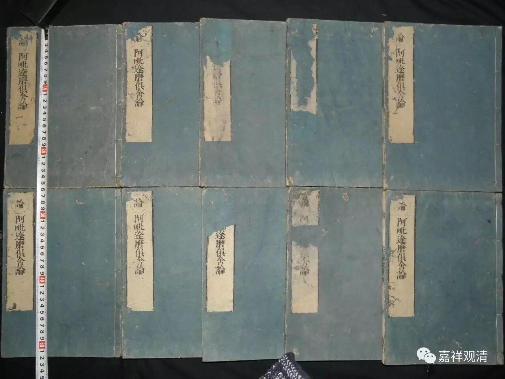

《俱舍论》八品总纲

世亲论师之总结有部之作——《阿毗达摩俱舍论》共有八品，以敷演圣教，即：界品、根品、世间品、业品、随眠品、贤圣品、智品、定品。另有《破我品》乃自独立成章，原不属于《俱舍论》而单独成篇。

唐·圆晖《俱舍颂疏》云：

**“此（《俱舍论》）颂上下总有八品：一、界品；二、根品；三、世间品；四、业品；五、随眠品；六、贤圣品；七、智品；八、定品。《破我》一品，无别正颂，故此不论。**

** 初二品总明有漏、无漏，后六品别明有漏、无漏。总是其本，所以先说；依总释别，所以后说。**

** 就总明中，初界品明诸法体，根品明诸法用。体是其本，所以先说；依体起用，故次明根。**

** 就别明六品中，初三品别明有漏，后三品别明无漏。有漏可厌，所以先说；厌已令欣无漏，所以后说。**

** 就别明有漏中，世品明果，业品明因，随眠品明缘。果麤易厌，所以先明；果不孤起，必藉于因，故次明业；因不孤起，必待于缘，所以后明随眠。**

** 就别明无漏中，贤圣品明果，智品明因，定品明缘。果相易欣，所以先说；果必藉因，故次明智；智必待缘。故后明定。”**

这是说，《俱舍论》八品的前后逻辑关系是：前两品总标，后六品别释。前二品，《界品》为体，《根品》为用。

后之六品，前三品明有漏之果、因、缘，后三品明无漏之果、因、缘。见下表。

 ** 《俱舍论》八品总表**

**
**

《阿毗达摩俱舍论》

总明有漏无漏

明诸法体

界品

明诸法用

根品

别明

有漏

无漏

明有漏

果

世间品

苦谛

因

业品

集谛

缘

随眠品

明无漏

果

贤圣品

灭谛

因

智品

道谛

缘

定品

传统的阿毗达摩，常用四谛分别，《俱舍论》也有按四谛来分别的线索，如上表，《世间品》为苦谛；《业品》、《烦恼品》为集谛；《贤圣品》为灭谛；《智品》、《定品》为道谛；以《界品》、《根品》为总标。亦可《界品》、《根品》、《世间品》总为苦谛，亦无不可。

