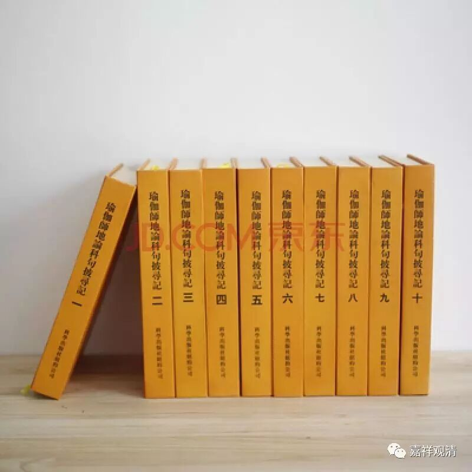

**《批寻记》勘误之**

** “不为随顺”与“随顺正行”**

《瑜伽师地论》卷三十八《本地分》中《菩萨地·第十五初持瑜伽处·力种姓品第八》：

** “谓听法时，应时而听，殷重而听，恭敬而听，不爲损害，不爲随顺，不求过失。由此六相，其心远离贡高杂染。”**

此段，《披寻记》有释，曰：

《披寻记》卷三十八：

** “坐卑座等，是名爲‘时’。以谦下心坐于卑座，具足威仪，随其所能，听闻正法，起恭敬相，是名‘应时而听’，‘殷重而听’，‘恭敬而听’。他说法时，应正了知，不障碍彼，多有所作，是名‘不爲损害’；爲欲启悟先未解义而兴请问，是名‘不爲随顺’；若不悟解，或复沉疑，终不讥诮，是名‘不求过失’。义如《瑜伽师地论》卷八十四。”（为便于理解，多加了几个标点帮助检查。）**

仔细观察，这一段《批寻记》的解释文字对应有误。捡《瑜伽师地论》卷八十四，其文曰（红字部分为《批寻记》引文）：

** “于时时间应听法者。至如是时应自观察。我今说法多有所作。他说法时应正了知勿我于中当为障碍。即便殷重。以谦下心坐于卑座。具足威仪。随其所能听闻正法。起恭敬相。为欲启悟先未解义而兴请问。若不悟解。或复沈疑终不讥诮。于其胜者恭敬随顺。于等于劣恭敬法故亦不轻蔑。”**（为免误读，仅存句读，暂不加多余标点。）

《批寻记》仅捡中间一段对应六相，而实当以整段来对应：

“‘于时时间应听法’者，至如是时，应自观察：‘我今说法多有所作。他说法时应正了知勿我于中当为障碍’”当释“应时而听”；

“即便殷重，以谦下心坐于卑座，具足威仪，随其所能听闻正法”当释“殷重而听”；

“起恭敬相，为欲启悟先未解义而兴请问”当释“恭敬而听”；

“若不悟解。或复沈疑终不讥诮”当释“不为损害”；

“于其胜者恭敬随顺”当释“不为随顺”（藏译做“随顺正行”，当是）；

“于等于劣恭敬法故亦不轻蔑”当释“不求过失”。

