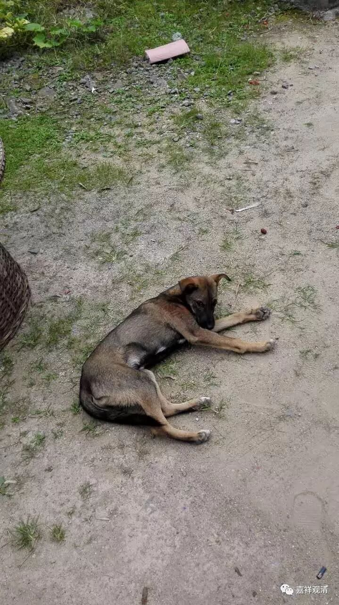
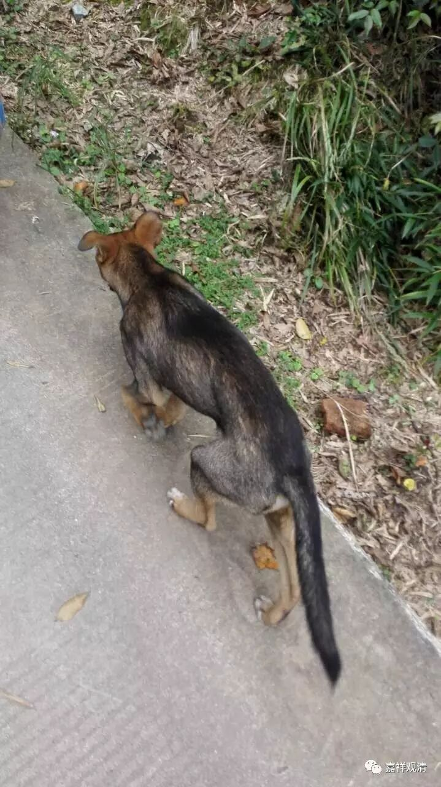
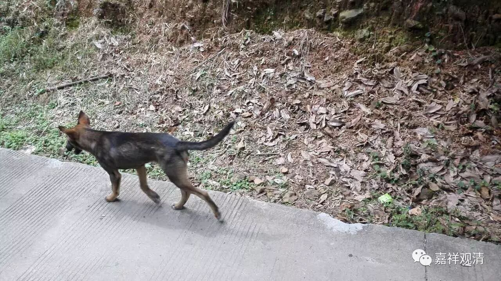
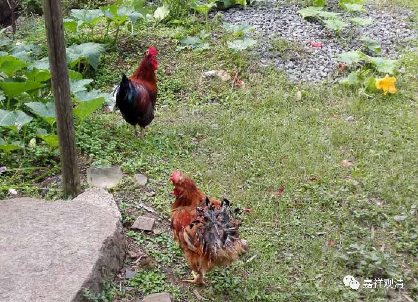
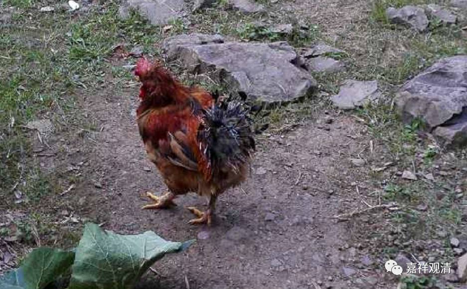
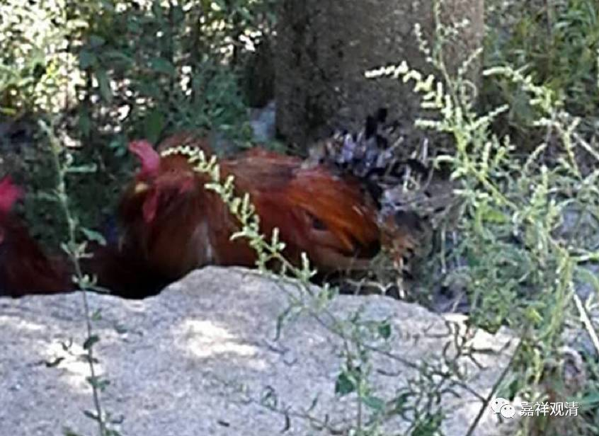
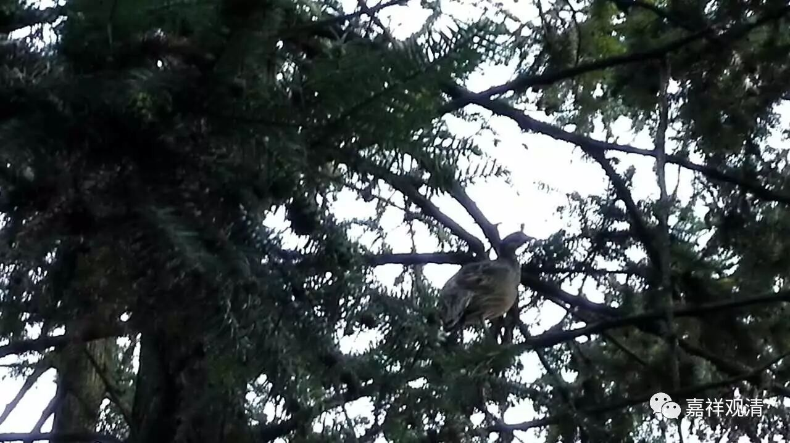

**小黑**

**
**

“小黑”是龙智师养的狗。

传说，半年前，有一天，一只母狗叼来一只小狗丢在庙里（大概知道我们不会吃了它吧），龙智师就收留下了，它，就叫了“小黑”。也就是说，今天它才半岁。

 

我们上上下下的时候，小黑经常会跟着，前两天跟几个香客下了山，小黑跟着走，直跑出十几里地去。

开山会那天，不见了小黑，后来发现躲在楼梯间，也许是鞭炮声音太烈，吓到小狗了。

不经意看到寺院里放生的肥鸡，这只尾巴上的羽毛全都秃了，像打烂了的羽毛球。他们说，这是小黑的杰作——把人家毛给拔了。我怀疑，可能小黑幼时受过它的欺负，现在算长大报仇了。这两只鸡以前可凶，啄死了另一只放生的兄弟鸡。

这是只野鸡吧，跑树上去了，这一幕也是小黑的杰作。那天小黑跟着我散步，忽然很警觉的样子，我还以为是草丛里有蛇呢。突然它就兴奋地上了坡，茶园里扑啦啦一阵动静，然后我就看到一只野鸡蹦（蹿？跳？飞？）上树了。小黑在树下来回转着，没辙——可能他想开次大荤吧（哈哈），它跟我散步时，经常蹿草丛里“吃零食”，那些昆虫碰上它算倒霉。

山上还有野兔，我没见过小黑追野兔。山上还有野猪，也很“小黑”，不知道它们啥时候能对上。

