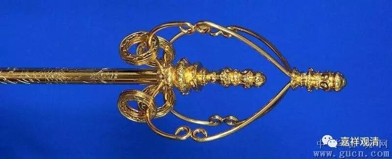

**略说禅杖的表意和形制**

今天有朋友问起禅杖的表意，我没找到合适的图，明天补上吧。先空口说说。

如法的禅杖，分三节，以象征戒、定、慧三学。另外，也可以象征三恶趣，提醒我们不要做恶业。

禅杖上面，有两个塔，代表二谛（胜义谛、世俗谛），或者代表佛的法身和色身。

两个塔之间，有四个“3”型的圈组成两对，代表四谛：苦、集、灭、道。也有做成两个“3”成一个平面的，那就代表二谛。

如果是四个“3”，在每个“3”的下面，吊三个圆环，这样4×3=12，代表十二因缘。如果是两个“3”的形制的禅杖，则吊六个圆环，2×6=12，也是表示十二因缘。这样，十二个圆环震动起来就会有声音，提醒居士：化斋的比丘在门前。

此下有三个小“啥轮”（你懂的），代表释迦牟尼佛三转那啥（你懂的）。

下面有个钩子，平时拿它挂在屋里的钉子上。这个钩子，代表佛度众生。

下面一节是七棱的棍子，代表七觉支。

更下面是八棱的，代表八圣道。

禅杖，出门的时候带着，也是防身——不是为了打架，驱驱蛇虫。也是比丘的资具之一。

上图的禅杖尚非全合经意。三门多宝讲寺十年前曾出过一款禅杖，大致完全按照以上所讲而制作。我们曾经请了送给老师父们，老师父都很满意的样子。

明天我找人拍了附上，到时候再多说两句吧。今天先说两句，算先交差了。哈哈……

