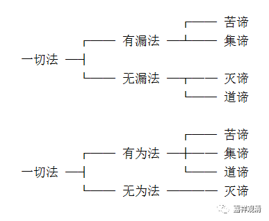

**“四谛”的“有漏”“无漏”、“有为”“无为”**

“四谛”，即苦、集、灭、道四谛，又称“苦圣谛”、“苦集圣谛”、“苦灭圣谛”、“苦灭道圣谛”。

根本说一切有部谈到“四谛”和有漏、无漏，有为、无为的关系，这大致我们可以看《俱舍论》。

《俱舍论》说：

** **

** “有漏无漏法，除道余有为，
　    于彼漏随增，故说名有漏；
　    无漏谓道谛，及三种无为。”**

这是说，一切法分为有漏法、无漏法二，或者有为法、无为法二。

四谛中，有三个是有为法：苦谛，集谛、道谛；一个是无为法：灭谛。

四谛中，二谛有漏：苦谛、集谛；二谛无漏：道谛、灭谛。

见下表：

                      ┌── 苦谛

     ┌── 有漏法 ─┴── 集谛
 一切法 ─┤
           └── 无漏法 ─┬── 灭谛

                      └── 道谛

                      ┌── 苦谛

     ┌── 有为法 ─┼── 集谛
 一切法 ─┤               └── 道谛
           └── 无为法 ──── 灭谛

