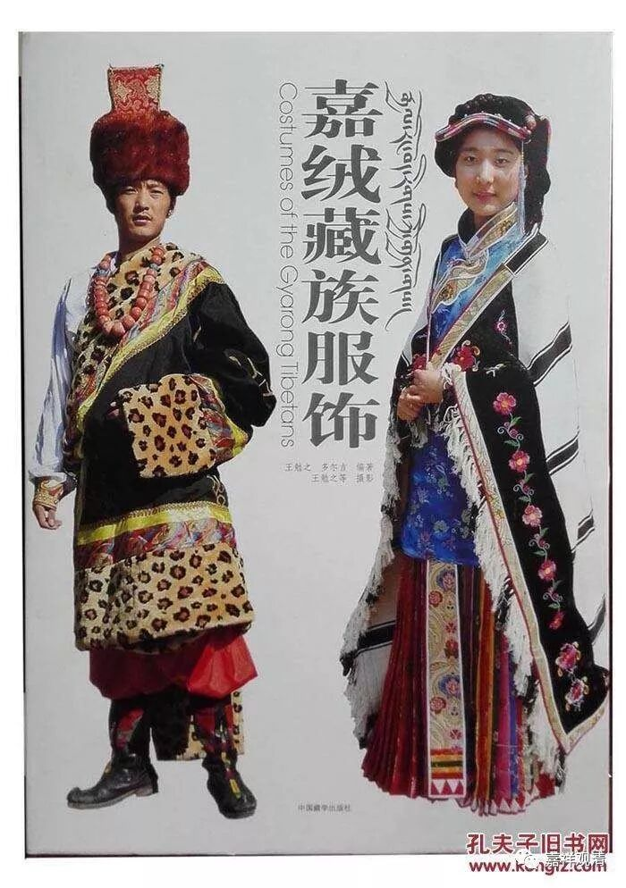

**八卦嘉绒和羌、藏的关系**

昨天巴大师网络梵文第一课。

课上提到四大语系，原先只知道两种，现在了解到大致有四种。

1，印欧语系，印度，伊朗、欧洲等大部分语言（英语、法语、德语、拉丁语）……属于这一语系；

2，汉藏语系：汉语（包括各种方言）、藏语、羌语、纳西语……等属于这一语系；

3，阿尔泰语系：阿尔泰山及其延伸、相关的一些民族的语言，如土耳其语、蒙古语、满语、维吾尔语等属于这一语系；

4，闪含语系，闪米特语、埃及语、乍得语等属于这一语系。

查了一点四大语系的资料，印证了我以前关于嘉绒藏人的一个猜测——“嘉绒藏人”从某种角度来说恐怕应该说“嘉绒羌人”。

嘉绒的藏人是一个藏区内部持很特殊语言的藏族，据说在三大寺的绝大多数僧人号称听不懂嘉绒人的语言，这并非如安多、卫藏那种方言的区别。听说堪苏仁波切回嘉绒时讲经也必须自译为嘉绒话。

我去嘉绒地区时，发现嘉绒藏人的大量风俗习惯、服饰建筑等实际更接近他们的友邻的另一个民族——羌人。相较于藏人，他们和羌人在这些方面的相似性更大。但由于不是做民族史研究的，也就没有继续追究下去。

学到语系这里，算是得到了另一个佐证：藏语和门巴语都属于汉藏语系中的藏语族，但嘉绒语和羌语、纳西语是属于汉藏语系的羌语族——可以发现，语言上来说，嘉绒语也更接近羌语！

所以，恐怕民族上来说，嘉绒人跟接近羌人；当然从宗教上来说，跟接近藏人。

