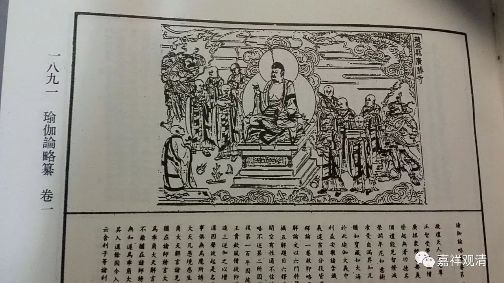

**《六门教授习定论》021（中）**

后面的** “安住”**两个字问题比较大，因为第三住心也叫** “安住”**，那么，这里的** “等遍安住”**的** “安住”**到底是“定”的意思，还是第三住心的意思呢？窥基大师认为，这个** “安住”**就是第三住心的** “安住”**，所以，由思维力成办的是** “等住”**和** “安住”**——这是第二种说法。

（窥基法师第一说）

九住心

六力

1

内住

听闻力

2

等住

思维力

3

安住

4

近住

忆念力

5

调顺

正知力

6

寂静

7

最极寂静

精进力

8

专注一趣

9

等持

串习力

那么，按照这种说法，由听闻力成办** “内住”**，由思维力成办** “等住”**和** “安住”**，由忆念力或正念力成办** “近住”**。为什么这样解释呢？我们看《瑜伽师地论》讲** “近住”**的时候，是这么说的：** “谓彼先应如是如是亲近念住，由此念故，数数作意内住其心，不令此心远住于外，故名近住。”**就是说在** “近住”**的时候呢，很明显地就有忆念或者正念，而在** “安住”**的时候则没有明显地讲** “念住”**。

我们再看关于忆念力的文字是怎么说的：** “如是于内系缚心已，由忆念力，数数作意摄录其心，令不散乱，安住、近住。”**它的文字就出现了** “安住”**、** “近住”**，就有人问窥基大师：“文字上明明写的是** ‘安住’**、** ‘近住’**，你为什么说由忆念力成办的是** ‘近住’**呢？”然后，窥基大师回答说：“这里的** ‘安住’**是动词，是指心‘** 安住’**在** ‘近住’**上。而前面的** ‘等遍安住’**中的** ‘安住’**，则是一个名词。”那他说了算哦！

与此同时，另外一位大师——写《遁伦记》的遁伦法师，或称为道伦法师，就跳出来说话了。他的意思是：前面** “等遍安住”**的** “安住”**才是动词，而后面忆念力对应的那个** “安住”**则是名词。也就是，他不认同窥基大师的说法。实际上遁伦法师的说法就和《瑜伽师地论》或者说和《广论》系统的一样，就是按照我们前面这个表格来的。他就是觉得，至少他和窥基大师的说法不一样，这里的** “安住”**不应该作为动词来解释，实际上是名词，而前面** “等遍安住”**的那个** “安住”**才是动词。

