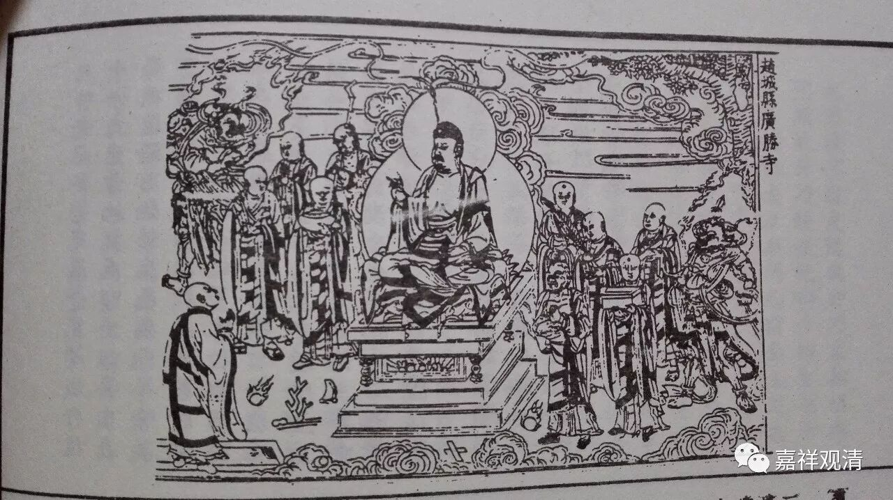

**《六门教授习定论》021（下）**

还有第三种说法！第三种说法是什么呢？也是窥基大师说的。** “初由听闻、思维二力……等遍安住。”**这个** “安住”**连在听闻力当中也要有了。就是说，听闻力和思维力都要同时管三个——** “内住”**、** “等住”**和** “安住”**。而“安住”要遍三个力——听闻力、思维力和正念力。这个是第三种说法，也是窥基大师说的。

（窥基法师第二说）

九住心

六力

1

内住

听闻力

思维力

2

等住

3

安住

忆念力

4

近住

5

调顺

正知力

6

寂静

7

最极寂静

精进力

8

专注一趣

9

等持

串习力

这里面还有个情况，《瑜伽师地论》里面是讲“六力”的，听闻力和思惟力是分开的，但是在窥基大师的《瑜伽师地论略纂》当中，是把听闻力和思维力放在一起的——闻思力。说是说“六力”，实际上窥基大师在解释的时候，是解释“五力”的，把听闻力和思维力一起放在闻思力当中，所以就是闻思力当中有** “安住”**。如果分开来说的话，就变成听闻力当中也有** “安住”**，思维力当中也有** “安住”**。

现在有了三种说法，第二种和第三种说法都是窥基大师在《瑜伽略篡》里面说的，文字上也站得住脚。他的意思是什么呢？最初生起的** “安住”**呢，是由听闻力成办的，之后生起的** “安住”**呢，是由思维力成办的。而第三种说法的意思是，由正念力也能成办一种** “安住”**，所以他说** “安住”**可以由三种力量来成办。

这里虽然讲的是“六力”，但是如果对《瑜伽师地论》进行科判的话，就有点累，实际上你只能科判出五个，因为听闻力和思维力被放在一起了。这个就是由“六力”成办。而你看《瑜伽师地论科句披寻记》的时候，说是“六力”成办，但是你去数科判的话，就只有五个，还有一个是找不到的，第一第二个并成一个了。

