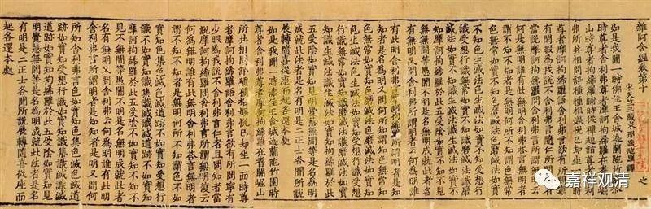

**《六门教授习定论》024（下）**

我们再看左边第二十一卷这一栏，这里的** “涅槃法缘”**分两个：前面十二个叫** “劣缘”**，最后一个叫** “胜缘”**。** “劣缘”**，就是修三摩地以前的资粮。后面的** “胜缘”**就是“寂因作意”。玄奘法师在《瑜伽师地论》里面是怎么翻译的呢？** “若依四谛法教增上所有教授、教诫他音”**，依四圣谛的法教上所讲的教授教诫，从他听闻。** “他音”**，就是我所听到的他讲的话，所以圣教是以音声为体的。从他听闻了以后呢，** “若如正理所引作意”**，“如理作意”在这部《六门教授习定论》的后面就讲到了，义净大师认为应该是“寂因作意”。

这样都对应起来，好像这部论，基本上就是按照《瑜伽师地论》的卷二十二而来的。又有一个很有趣的情况，这一段又是依经来的。这样看起来，可能这部《六门教授习定论》是按照某一部《阿含经》所进行的一个总结，相当于它是某一部《阿含经》的本母。

在《瑜伽师地论》的第九十八卷里面是说声闻的十一种资粮，也是按照上面的内容来的，就是把** “闻正法”**和** “思正法”**合并放在一起，而前面是从** “正出家”**开始算，** “自圆满”**、** “他圆满”**和** “善法欲”**这几个暂时不算，这样就变成了十一种资粮。

序号

卷第二十二       离欲资粮

卷第九十八

序号

1

自圆满

2

他圆满

3

善法欲

4

（缺：正出家）

正出家

1

5

戒律仪

戒律仪

2

6

根律仪

根律仪

3

7

食知量

食知量

4

8

悎寤瑜伽

悎寤瑜伽

5

9

正知而住

正知而住

6

10

善友性

善友性

7

11

闻正法

闻正法

8

12

思正法

思正法

13

无障碍

无障碍

9

14

修惠舍

修惠舍

10

15

沙门庄严

沙门庄严

11

而第九十八卷是哪里来的呢？第九十八卷是属于“契经事”的，现在吕澂先生已经把它找出来了，这段相对应的是《杂阿含经》。它其实相当于《杂阿含经》的本母，好像《杂阿含经》的一个科摄。而且现在看起来，好像这段是相应于好几部《阿含经》当中的内容，好像还可以相应于《沙门果经》。

如果从对应来看的话，《六门教授习定论》就是从《阿含经》里面总结出来的。唯识派论师的习惯真是很喜欢总结啊！只是《六门教授习定论》的科判和《瑜伽师地论》的科判有点不一样。

