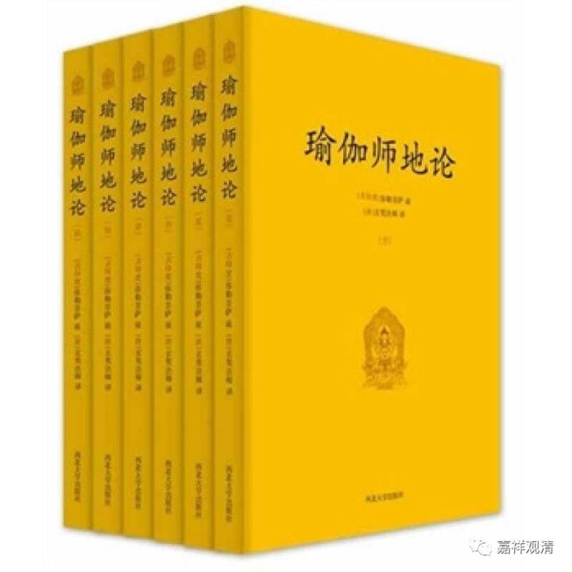

《瑜伽师地论》“七例句”和“八啭声”

《瑜伽师地论》卷二有所谓“七言论句”，即“七例句”，初学颇不能解。文曰：

**“又有七言论句。此即七例句：谓补卢沙，补卢衫，补卢崽拏，补卢沙耶，补卢沙䫂，补卢杀娑，补卢铩。如是等。”**

此“七例句”，即梵文八格中除“呼格”以外的其余七格。其梵文语法里，也有不算呼格而只说七个格的。

梵语的八格，《瑜伽师地论遁伦记》说：

** “汎声有三：一：男；二、女；三、非男女。一一各有八：一、体；二、业；三、具；四、为；五、从；六、属；七、依；八、呼。”**

此即阳性、阴性、中性词。外加八个格：体格、业格、具格、为格、从格、属格、依格、呼格。

月官《八啭声颂》说：

** “盛华林有树，其树被风飘，以树推象倒，为树故放水，**

** 从树华盛发，是树枝甚低，于树鸟作巢，咄咄树端严。**

** 第一显本事，第二知是业，第三作作者，第四为何施，**

** 第五从何来，第六囗（注1）增上，第七示住处，第八是呼词。”**

** 《八啭声颂》**

此即八格之简释。

《大慈恩寺三藏法师传》也解释了八啭声：

** “言八啭者：一、诠诸法体，二、诠所作业，三、诠作具及能作者，四、诠所为事，五、诠所因事，六、诠所属事，七、诠所依事，八、诠呼召事。”**

继而《大慈恩寺三藏法师传》以“士夫”为例，做三性×八啭声的变化，其第一列男声（阳性）的八啭的前七个，就是《瑜伽师地论》的“七例句”了：

** “且以男声寄‘丈夫’上作八啭者，丈夫印度语名布路沙。**

** 体三啭者，一、布路杀，二、布路筲，三、布路沙(去声)。**

** 所作业三者，一、布路芟，二、布路筲，三、布路霜。**

** 作具作者三者，一、布路铩拏，二、布路(音鞞僣反)，三、布路铩鞞，或言布铩呬。**

** 所为事三者，一、布路厦(沙诈反)耶，二、布路沙(鞞僣反)，三、布路铩[韵>䪨(鞞约反)。**

** 所因三者，一、布路沙哆(他我反)，二、布路铩(同上)，三、布路铩[韵>䪨](鞞约反)。**

** 所属三者，一、布路铩[言*罝](子耶反)，二、布路铩，三、布路铩諵(安咸反)。**

** 所依三者，一、布路䐤(所齐反)，二、布路杀谕，三、布路铩绉(所刍反)。**

** 呼召三者，一、系布路杀，二、系布路稍，三、系布路沙。**

** 略举一二如此，余例可知，难为具述。”**

**
**

** ————————————————**

**
**

** 注1：**

**
**

据《周叔迦佛学论著集》谓：“第六下一字破损，疑是‘由’字。”

然考八啭声，第五为“从格”，即“由……”、“从……”，第六转为“属格”，即“何之”、“……的”。故这里的漏字，当作“属”字为妥。

若依藏文，作“力增上”。由于此颂乃从藏文转译，故似当作“力增上”更妥。

**
**

**
**

**
**

