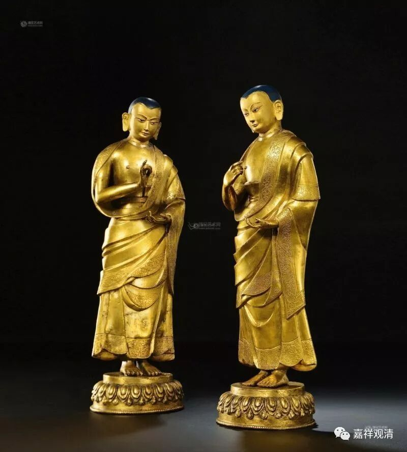

**《六门教授习定论》027（中）**

……

那个时候，舍利弗还是没有证果。其实，佛教的经典里面有很多内容都没有讲，舍利弗那个时候，是比较早地给释迦牟尼佛做侍者的，就是拿把扇子站在边上扇凉，估计也扇蚊子，因为山里面蚊子还是有的，至少小乘佛教认为释迦牟尼佛是从凡夫而来的，还是会被蚊子叮的，要不然这个蚊子“出佛身血”也蛮厉害的。

然后舍利弗的舅舅长爪梵志听说了这件事，“咦？我外甥跟了释迦牟尼这个人了……”他就跑去和释迦牟尼佛辩论。释迦牟尼佛就说：“你是什么观点？”他回答说：“我没有观点。”然后就跑了。

他毕竟是聪明人嘛，有“正知而住”的这种感觉。跑了之后就想：“好像我刚才的那句话不对嘛。他问我有什么观点，我回答的是没有观点。那我到底有没有观点呢？‘我没有观点’——那我就还是有观点的喽！我还以为我赢了，释迦牟尼佛输了呢，其实是我输了。”

他觉得“我输了”之后，就回到释迦牟尼佛那里去了，然后开始听课。释迦牟尼佛为长爪梵志开示的时候，舍利弗就站在边上为佛陀扇凉，听着听着就证得阿罗汉果了。（如果这个故事给西藏人听到了，可能西藏人都会很喜欢在活佛边上扇扇子了。）后来，等舍利弗证四果以候，释迦牟尼佛就把附近的弟子都召集过来，说：“以前其他的佛身边都有‘第一双’，今天我身边的‘第一双’也出现了——舍利弗和目犍连。”

我们继续本论。** “一、善护诸根。二、饮食知量。三、初夜后夜能自警觉与定相应。四、于四威仪中正念而住。”**这个四段正好就是《瑜伽师地论》的** “根律仪”**、** “食知量”**、** “悎寤瑜伽”**和** “正知而住”**。

