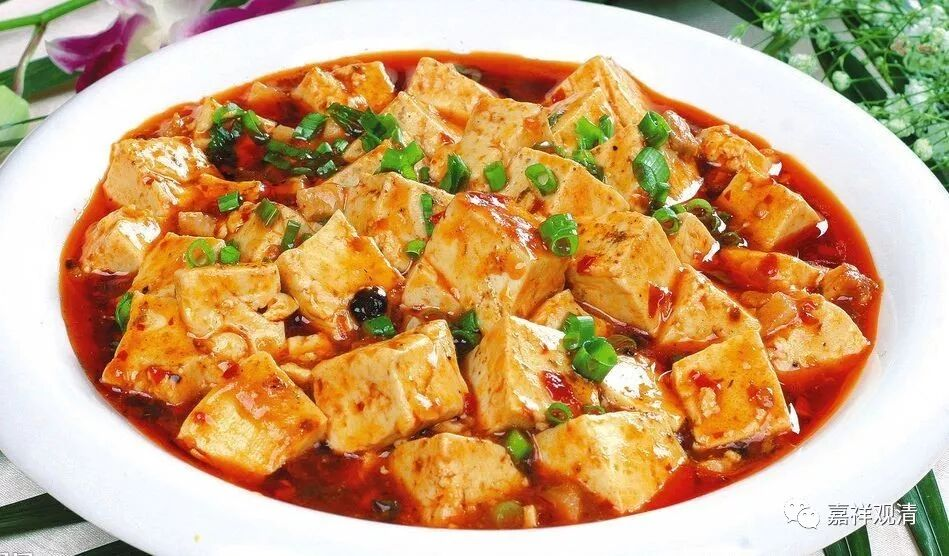

**由譬喻门显“色受想行识”前后次第**

《俱舍论》：

“随粗染器等，界别次第立。”

这是在回答，为什么五蕴按照“色、受、想、行、识”这样的次第安立。回答说：有四种原因，五蕴依“色、受、想、行、识”这样的次第安立：1、随粗；2、随染；3、随器等；4、随界别。

现在谈谈第三，随器等。“器等”，就是1、器皿；2、饮食；3、调料；4、厨师；5、食者。这是从比喻门来解释五蕴安立次第。

《俱舍论》说：

“……或色如器，受类饮食，想同助味，行似厨人，识喻食者——故随器等立蕴次第。”

《俱舍颂疏》解释说：

“第三，随器等次第者。器等者，“等”取饮食、助味、厨人、食者也。夫欲请客，先求食器；既得其器，次求米面以为饮食；米面已辨，次求盐酢以为助味；便付厨人，使令调合；饮食既办，进客令食。

‘色蕴如器’：如世间器，饮食所依；色亦如是，受所依故。

‘受类饮食’：如世间食，有损有益；受亦如是，乐受益人，苦受便损。

‘想同助味’：如世盐醋，助生食味；想亦如是，起怨想时，生苦受味，起亲想时，生乐受味。

‘行似厨人’：由行蕴中有业烦恼，能感异熟；如世厨人，造得饮食。

‘识喻食者’：受果报故。

故随器等，立蕴次第。”

这是说，五蕴的次第安立，有第三个原因，是一个譬喻：就比如我们要吃东西：1、先有器皿，2、装上食品，3、还需要各种调味品，4、经过厨师的调制，5、最终人们得以尝味道。

1、“色”，如器皿，因为受依它而起；2、“受”如饮食，有好、有坏、喜欢、不喜欢；3、“想”如助味的调料，有些事情，境虽相同，但想法不一样，感受也会大不相同；4、“行”就像厨师，造作百味；5、“识”就像尝味道的人，辨别滋味，最后完成吃饭这件事。

这里用譬喻的方法来解释五蕴安立的次第，是一个很有意思的视角。

