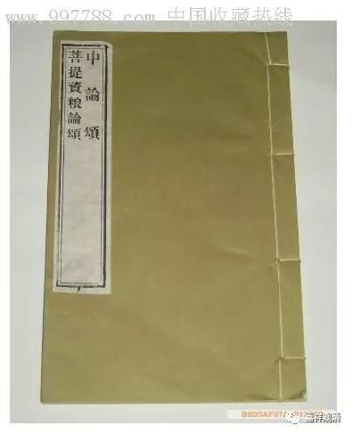

**“佛能灭有无”&“佛能知有无”**

《中论·观有无品第十一》第七颂：

** “佛能灭有无，如化迦旃延，**

** 经中之所说，离有亦离无。”**

此颂第一句，吕澂先生译作：“佛能知有无”。此从仅存之梵文《中论》（即梵文本月称《明句论》）而来。《中论》梵本此颂作：

kātyāyanāvavāde câstîti nâstîti côbhayam |

pratiṣiddhaṃ bhagavatā bhāvābhāvavibhāvinā |

但查清辨·《般若灯论》、安慧·《大乘中观释论》，似皆同什译，谓佛能“离有无”或“不着有无”，并且，“离有无”比“知有无”似乎更符合《迦旃延经》的原文。对照诸译，拟表如下：

颂文

梵文《中论颂》

kātyāyanāvavāde câstîti nâstîti côbhayam |

pratiṣiddhaṃ bhagavatā bhāvābhāvavibhāvinā |

藏文《中论颂》

བཅོམ་ལྡན་དངོས་དང་དངོས་མེད་པ།།

སྟོན་པས་ཀཱཏྱཱ་ཡ་ན་ཡི།།

གདམས་ངག་ལས་ནི་ཡོད་པ་དང་།།

མེད་པ་གཉིས་ཀའང་དགག་པ་མཛད

《中论颂》姚秦·罗什译

佛能灭有无，如化迦旃延，

经中之所说，离有亦离无。

《般若灯论》唐·波颇密多罗译

佛能如实观，不着有无法，
教授迦旃延，令离有无二。

《大乘中观释论》宋·惟净、法护译

世尊已成就，离有亦离无，
教授迦旃延，应离有无二。

《正理海》江波·稿本

了知有无事，世尊于《教诫

迦旃延经》中，俱破有无二。

程恭让译颂

在《化迦旃延经》中，所谓“有”、“无”二者，

是由理解有、无的薄伽梵已经遮止的。

按：这里提到的《迦旃延经》、《删陀迦旃延经》或者《化迦旃延经》，即《杂阿含经》卷十二之（三○一）经：

** 尔时，尊者跚陀迦旃延诣佛所，稽首佛足，退住一面。白佛言：“世尊！如世尊说正见。云何正见？云何世尊施设正见？”**

** 佛告跚陀迦旃延：“世间有二种依：若有、若无，为取所触；取所触故，或依有，或依无。若无此取者，心境系著使不取、不住、不计我。苦生而生，苦灭而灭。於彼不疑、不惑。不由於他而自知——是名正见！是名如来所施设正见！**

** 所以者何？世间集，如实正知见：若世间无者，不有！世间灭，如实正知见：若世间有者，无有！是名离於二边说於中道。**

** 所谓此有故彼有，此起故彼起。谓缘无明，行；乃至纯大苦聚集。无明灭故，行灭；乃至纯大苦聚灭。”**

