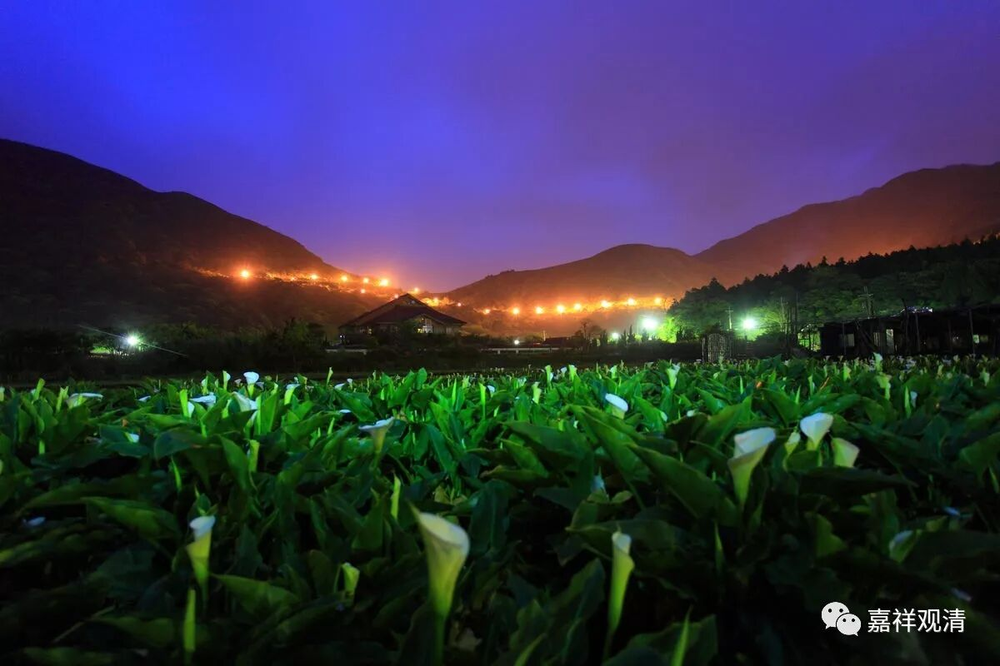
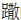

删陀迦旃延&摩诃迦旃延

据《大智度论》，奉世尊遗教，阿难去教化阐那时，为他复述了《迦旃延经》。《杂阿含经》卷十（262经）：

“……尔时，阿难语阐陀言：‘我亲从佛闻，教摩诃迦旃延言：

世人颠倒依于二边，若有、若无；世人取诸境界，心便计着。迦旃延，若不受、不取、不住、不计于我，此苦生时生，灭时灭。迦旃延，于此不疑、不惑、不由于他而能自知，是名正见，如来所说。

所以者何？迦旃延，如实正观世间集者，则不生世间无见；如实正观世间灭，则不生世间有见。迦旃延，如来离于二边，说于中道，所谓此有故彼有，此生故彼生。谓缘无明有行，乃至生、老、病、死、忧、悲、恼、苦集。所谓此无故彼无，此灭故彼灭。谓无明灭则行灭，乃至生、老、病、死、忧、悲、恼、苦灭……’”

勘，此经对应南传相应部22相应90经阐陀经：

……（阿难云：）“阐陀学友！我在世尊面前曾听到这样；当面领受[世尊]对迦旃延氏比丘的教导：‘迦旃延！这世间多数依於两者：实有的观念与虚无的观念。

迦旃延！以正确之慧如实见世间集者，对世间不存虚无的观念；以正确之慧如实见世间灭者，对世间不存实有的观念。

迦旃延！这世间多数为攀住、执取、黏著所束缚，但对攀住、执取、心的依处、执持、烦恼潜在趋势不攀取、不执取，不固持「我的真我」的人，对所生起的只是苦的生起，所灭去的只是苦的灭去[一事]，不困惑、不怀疑，不依於他人而智慧在这里生成，迦旃延！这个情形是正见。

迦旃延！‘一切实有’，这是第一种极端；‘一切虚无’，这是第二种极端。

迦旃延！不往这两个极端后，如来以中间教导法：以无明为缘而有行；以行为缘而有识；以识为缘而有名色（五蕴）；以名色为缘而有六处；以六处为缘而有六触；以六触为缘而有（三）受；以受为缘而有爱；以爱为缘而有（四）取；以取为缘而有（三）有，以有为缘而有生；以生为缘而有老死，于是忧悲苦恼等大苦聚集。这样是这整个苦蕴的集。

但就以那无明的无余褪去与灭而行灭；……（中略）这样是这整个苦蕴的灭。’

（阐陀云：）‘阿难学友！对那些有同梵行者怜愍、乐於利益、教诫、训诫的尊者们来说，正是这样，而现在，我听到尊者阿难的说法，已现观了法。’

南传相应部引文的“迦旃延氏”，巴利文经典原文作kaccānagottaṃ，迦旃延，巴利文原文作kaccāna，对应的汉文《杂阿含》，做“摩诃迦旃延”（mahākaccāna）。

这样，似乎，前述几部经、律中的kaccānagotto、kaccānagottaṃ迦旃延氏、kaccānagotra迦求陀迦旃延、迦求陀栴延、mahākaccāna摩诃迦旃延、kaccāna迦旃延，《杂阿含》的陀迦旃延，《大智度论》的“删陀迦旃延”、《中论》的迦旃延kātyāyanā都指向一个人——大迦旃延。至少，现有的经典更多地指出这一趋势。

（当然也还有矛盾之处，如摩诃迦旃延传记里记载是出自见佛时便证阿罗汉果位，但《杂阿含·301》则说是在经历了这段有关有无中道开示后证阿罗汉果的。）

