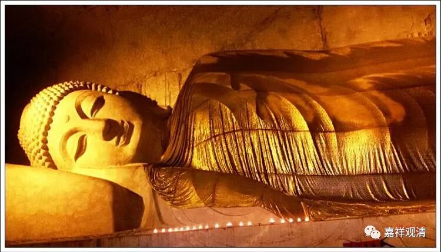
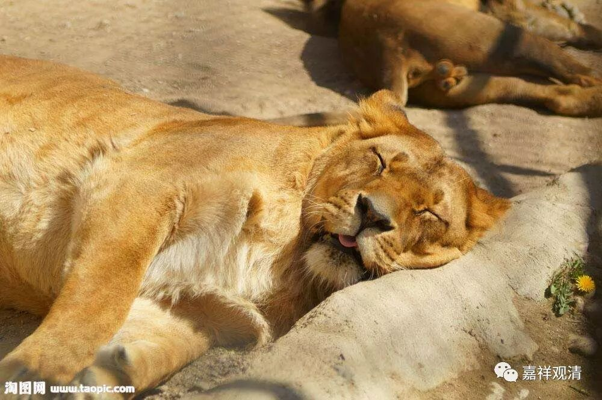

**《六门教授习定论》031（四）**

** “问：以何因缘右胁而卧？答：与狮子王法相似故。”**这里的** “狮子王”**，意思就是指狮王，像狮子王那样右侧卧。

但是我觉得这个** “狮子王”**就是指佛。我曾经很无聊地查了一下狮子睡觉的状况，结果发现狮子是什么睡相都有的，并不是只有** “右胁而卧”**。它除了不是仰天睡的以外，几乎哪种睡相都有，甚至挂在树上睡的也有。所以说，这个** “狮子王”**应该就是指佛，佛被称为大狮王，是这样** “右胁而卧”**睡觉的。

（你看，狮子们的姿势很自由、奔放嘛）

你们自己睡的时候可以试试。我自己是这样的：如果右侧而卧，刚开始的时候会比较不容易睡着，很惊醒，有点睡不进去，但是睡着了以后，吉祥的状态会比较多。二零零三年非典的时候，有两个广州来的导游，到了黄山以后就下不去了，他们本来就是从广州来的，又是导游，根本就回不去了，只能在我们山上住着。大家一起聊天的时候就说，学佛能不能有些什么感应之类。我就让他们试试看，右侧而卧，应该是一个礼拜左右，就会有吉祥的梦。

狮子卧（右侧卧）入睡的时候，你要修光明想，不一定要想其他法光明之类的，你就想菩萨，比如想文殊菩萨、观音菩萨等等，这样右胁而卧地睡觉，应该是很快就会有吉祥的梦。结果没过几天，他们就说果真有吉祥的梦，真好。

