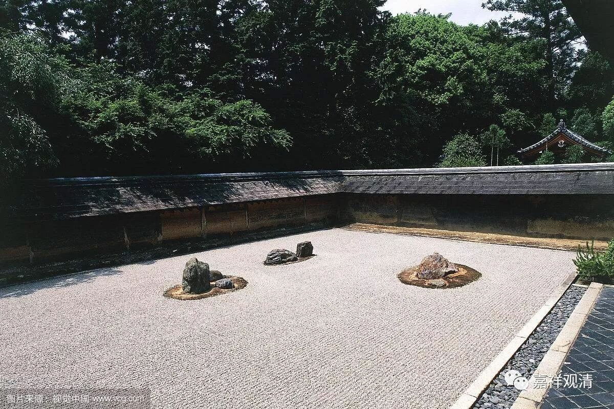

**《写在新年台历边上》**

亲友如云——聚散；

盛衰如虹——影幻；

身寿如露——修短。

勿自欺，

离放逸，

勤闻思。

世间苦相万千，

轮回无伴颠连，

祈于怙主尊前。

盛衰，修心之境；

好恶，修心之贼；

利乐，修心之诱惑。

信为能入，

戒为能护，

慧为能度。

莫自高，莫自欺，常自省。

轮回路险，当求出世；

衰相现起，痛悔已迟；

莫再沉溺，速趋真实！

烦恼比智慧坚韧，

名利比实有难舍，

解脱比流转痛苦

——你，准备好了吗？

总去扬汤止沸，

频频负薪救火，

实当釜底抽薪！

怜悯头陀，悲心颠倒；

营求名利，精进颠倒；

俗事辛劳，忍辱颠倒！

自虽不敏不牵累圣教，

依师教授践行胜上道，

蒙昧如我祈佛常护佑!

三有路险，胡为归处；

有心无力，净土暂住；

难忍能忍，不辞应赴！

广厦精榻，一时荣胜；

福寿美誉，一息支持;

——无常大贼，随时劫夺！

教法大海莫贪世间饵，

沉溺名利智者所诃责，

当取教授静处起精进！

