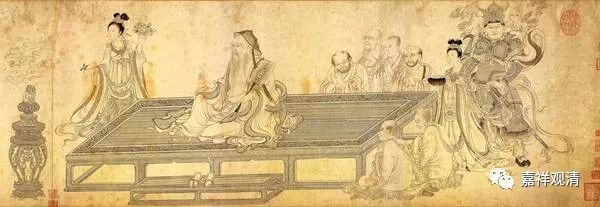

**维摩诘的“无言说分别”**

（一）版本

《维摩诘经》在大乘里非常有名，其中《不二法门品》里诸菩萨各呈对“不二法门”的理解，最后是文殊菩萨与维摩诘大士的问答。在玄奘法师翻译的《说无垢称经》中是这样的：

** “妙吉祥告诸菩萨：‘汝等所言虽皆是善，如我意者，汝等此说犹名为二。若诸菩萨于一切法无言、无说，无表、无示，离诸戏论、绝于分别，是为悟入不二法门。’**

** 时妙吉祥复问菩萨无垢称言：‘我等随意各别说已，仁者当说，云何菩萨名为悟入不二法门？’**

** 时无垢称默然无说。**

** 妙吉祥言：‘善哉善哉！如是菩萨是真悟入不二法门，于中都无一切文字言说分别。’”**

罗什的《维摩诘经》译本作：

** “文殊师利曰：‘如我意者，于一切法无言无说，无示无识，离诸问答，是为入不二法门。’**

** 于是文殊师利问维摩诘：‘我等各自说已，仁者当说何等是菩萨入不二法门？’**

** 时维摩诘默然无言。**

** 文殊师利叹曰：‘善哉！善哉！乃至无有文字、语言，是真入不二法门。’”**

但在吴·支谦版的《佛说维摩诘经》中，最后维摩诘的“默然无说”这一段是没有的：

** “如是，诸菩萨各各说已，又问文殊师利：‘何谓菩萨不二入法门者？’**

** 文殊师利曰：‘如彼所言，皆各建行，于一切法如，无所取、无度、无得、无思、无知、无见、无闻，是谓不二入。’”**

（二）分别

玄奘译本最后说：‘善哉善哉！如是菩萨是真悟入不二法门，于中都无一切文字言说** 分别**。’这里的“** 分别**”一词，罗什本也没有出现，仅谓“乃至无有文字、语言，是真入不二法门。”藏文本此处作“རྣམ་པར་རིག་བྱེ”，

意思是“识”、“能了别”、“唯表”。此处或仍当作“分别”、“施设”为好。（过两天查一下梵文学习一下。）

